# 如何维护头信息模板

本指引用于培训管理员或关键用户维护头信息模板。头信息模板用于在单据中快速套用基本信息、合同头字段、银行与收货信息，减少重复录入并统一对外口径。

## 适用场景

- 不同客户、供应商或业务场景需要复用固定的贸易条款。
- 报价单、销售合同或采购合同需要快速套用部门、币种、付款条件等信息。
- 收款账户、收货地址或银行信息需要按场景快速带入。
- 业务单据经常重复填写相同头信息，希望减少录入错误。
- 需要将基础信息、贸易条款和银行收货信息分开维护，便于单据中分别套用。

## 区块说明

| 适用区块 | 典型字段 | 使用方式 |
|---|---|---|
| 基本信息 | 负责人、部门、币种、备注 | 单据基本信息区域套用 |
| 合同头字段 | 模板、参考号/PO、Incoterm、港口、付款条件、交期、单证要求、质量条款、包装条款 | 贸易条款或合同头部区域套用 |
| 银行与收货 | 收货地址、收货国家、邮编、收款户名、账号、开户行、银行地址、SWIFT | 收款信息或收货信息区域套用 |

## 字段填写说明

| 字段 | 填写方式 | 注意事项 |
|---|---|---|
| 模板编码 | 使用唯一编码，例如 `HS-TRADE-FOB` | 保存后用于稳定识别模板 |
| 模板名称 | 使用业务可读名称 | 用户在单据下拉框中会看到名称 |
| 适用区块 | 新增时选择基本信息、合同头字段、银行与收货 | 已有模板不可切换区块 |
| 适用对象 | 通用、客户或供应商 | 用于限制模板在对应单据中出现 |
| 备注 | 说明适用范围或维护口径 | 帮助后续判断是否可复用 |
| 区块字段 | 按该区块的字段逐项填写 | 留空字段不会覆盖单据原值 |

## 步骤 01：进入头信息模板

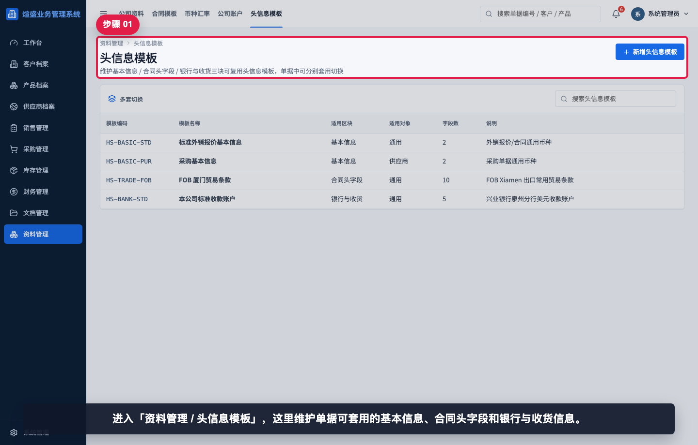

进入“资料管理 / 头信息模板”。这里维护单据可套用的基本信息、合同头字段和银行与收货信息。

## 步骤 02：查看头信息模板列表

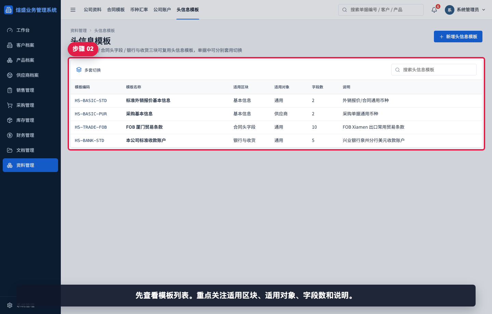

先查看模板列表。重点关注适用区块、适用对象、字段数和说明。

## 步骤 03：搜索贸易条款模板

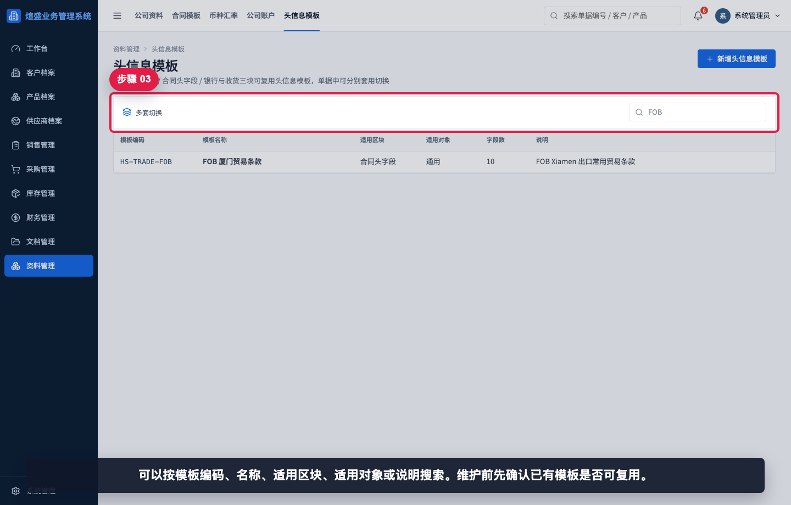

可以按模板编码、名称、适用区块、适用对象或说明搜索。维护前先确认已有模板是否可复用。

## 步骤 04：打开现有头信息模板

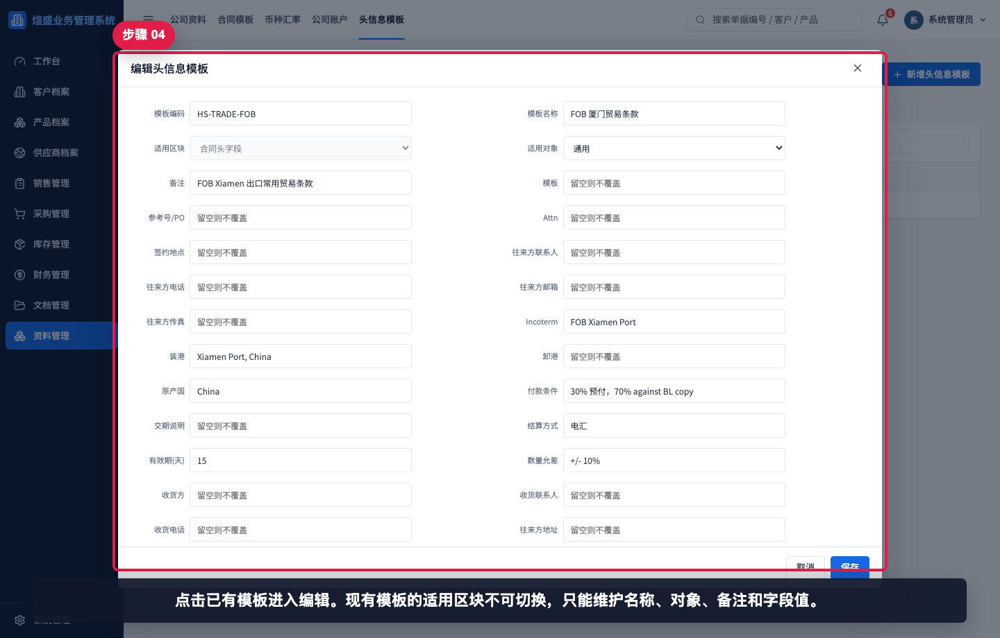

点击已有模板进入编辑。现有模板的适用区块不可切换，只能维护名称、对象、备注和字段值。

## 步骤 05：核对适用区块和对象

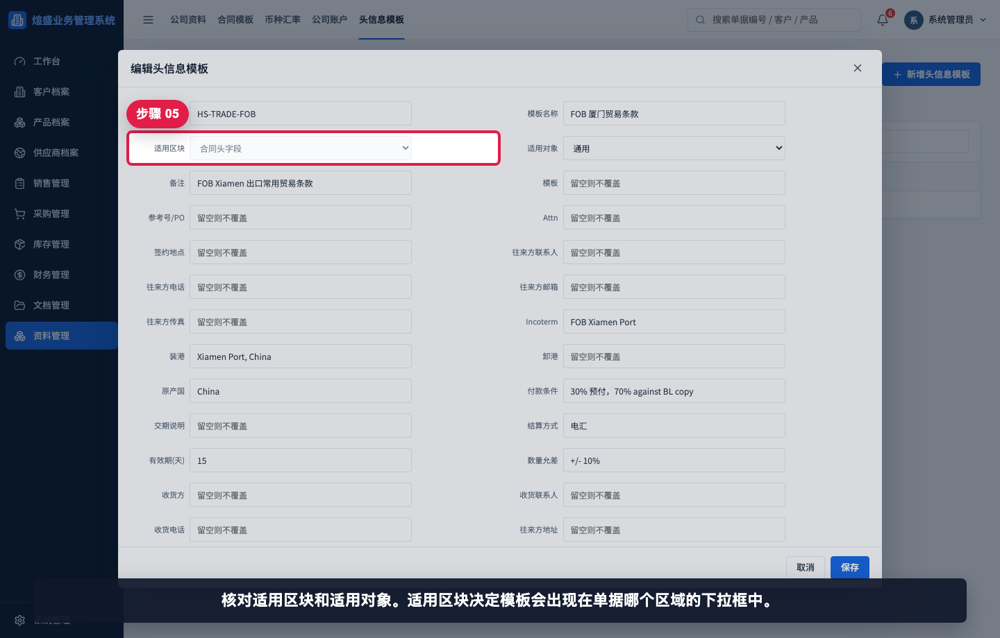

核对适用区块和适用对象。适用区块决定模板会出现在单据哪个区域的下拉框中。

## 步骤 06：核对贸易条款字段

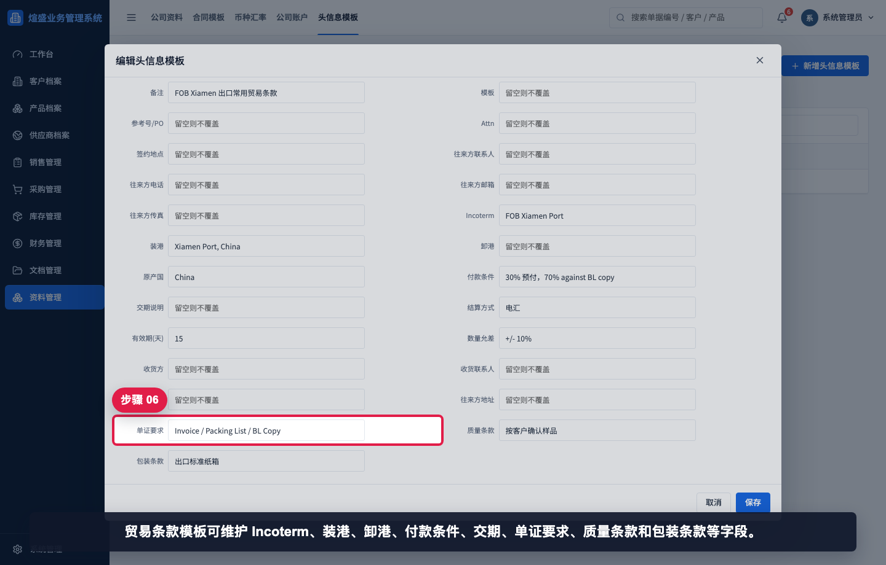

贸易条款模板可维护 Incoterm、装港、卸港、付款条件、交期、单证要求、质量条款和包装条款等字段。

## 步骤 07：新增头信息模板

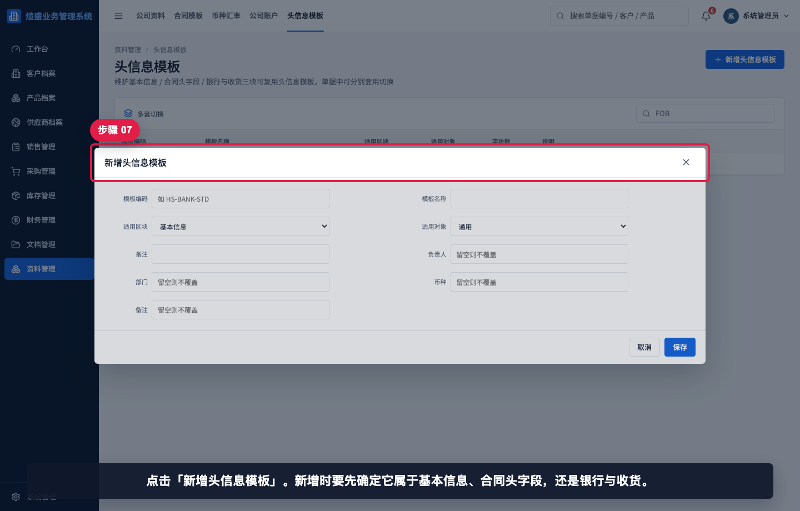

点击“新增头信息模板”。新增时要先确定它属于基本信息、合同头字段，还是银行与收货。

## 步骤 08：选择银行与收货区块

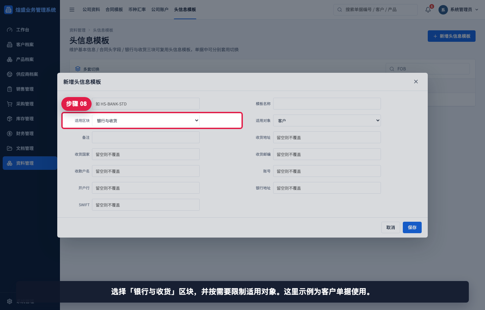

选择“银行与收货”区块，并按需要限制适用对象。示例中选择客户单据使用。

## 步骤 09：填写模板识别信息

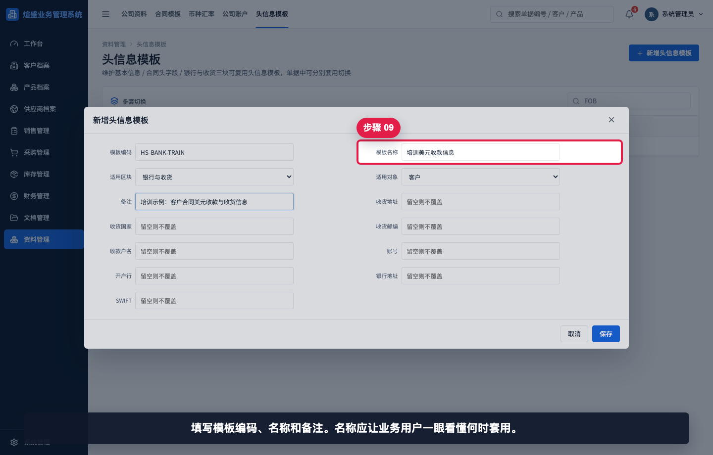

填写模板编码、名称和备注。名称应让业务用户一眼看懂何时套用。

## 步骤 10：填写收货信息

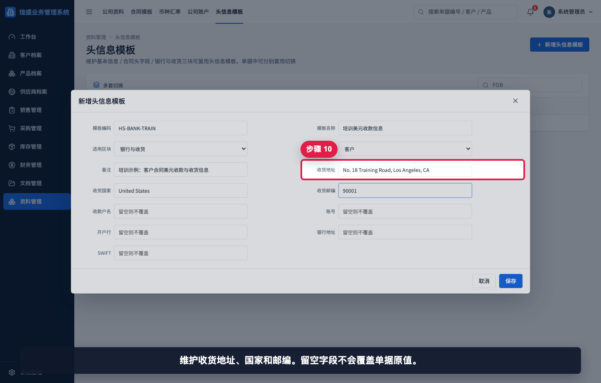

维护收货地址、国家和邮编。留空字段不会覆盖单据原值。

## 步骤 11：填写银行信息

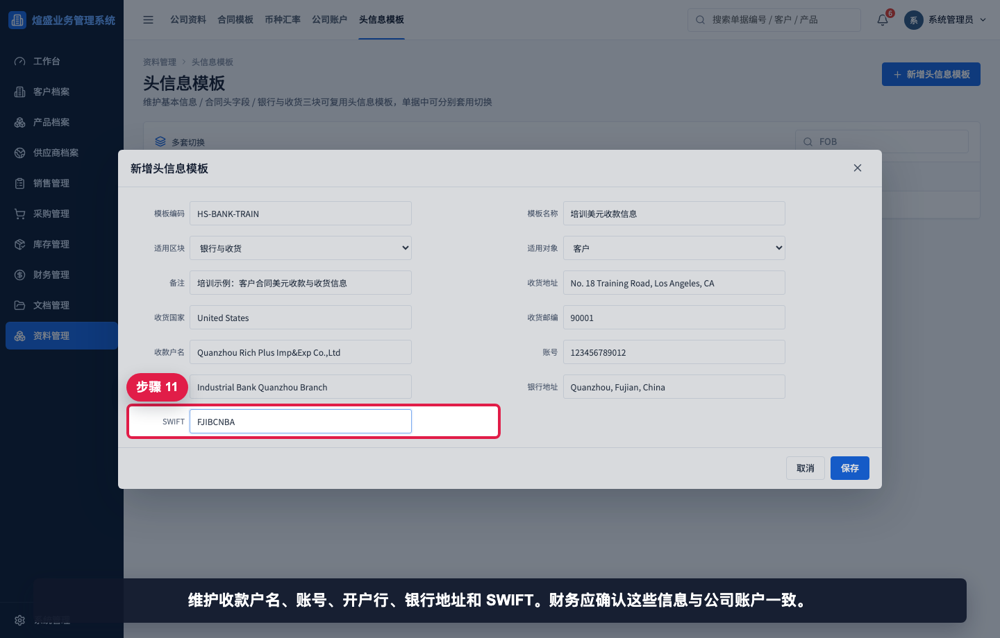

维护收款户名、账号、开户行、银行地址和 SWIFT。财务应确认这些信息与公司账户一致。

## 步骤 12：保存后查看头信息模板

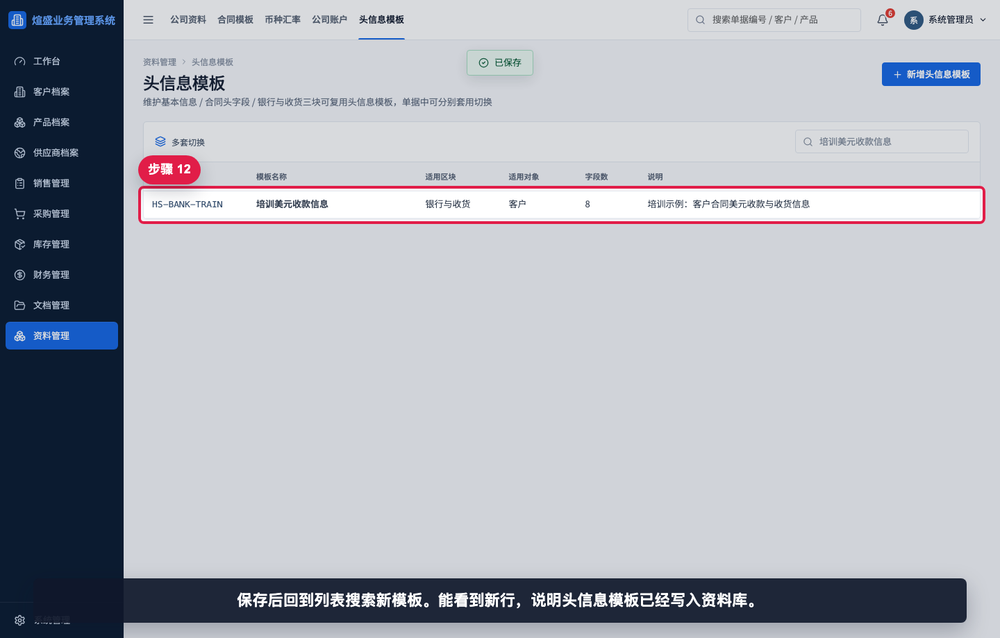

保存后回到列表搜索新模板。能看到新行，说明头信息模板已经写入资料库。

## 相关教程

- [如何维护公司资料](../维护公司资料/README.md)
- [如何维护合同模板](../维护合同模板/README.md)
- [如何维护公司账户](../维护公司账户/README.md)
- [如何创建报价单](../../销售管理/创建报价单/README.md)

## 常见错误

- 新增时选错适用区块。已有模板不能切换区块，选错后应重新建模板。
- 适用对象设置过窄，导致某些单据中看不到模板。
- 把收款账户信息只维护在头信息模板里，却没有维护公司账户。财务单据仍应以公司账户为准。
- 留空字段误以为会清空单据。留空字段不会覆盖原值。
- 模板名称过于笼统，业务用户无法判断该套用哪一个。

## 保存前检查清单

- 模板编码是否唯一、稳定、符合命名规范。
- 适用区块是否正确。
- 适用对象是否符合客户、供应商或通用场景。
- 区块字段是否只填写需要统一覆盖的内容。
- 收款和银行字段是否已经由财务确认。
- 保存后是否能在列表中搜索到该模板。
