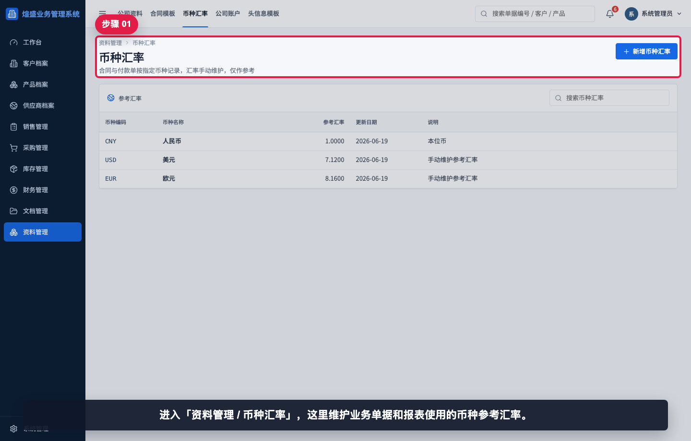
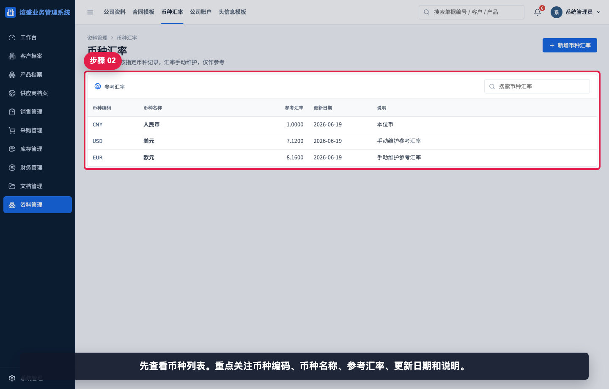
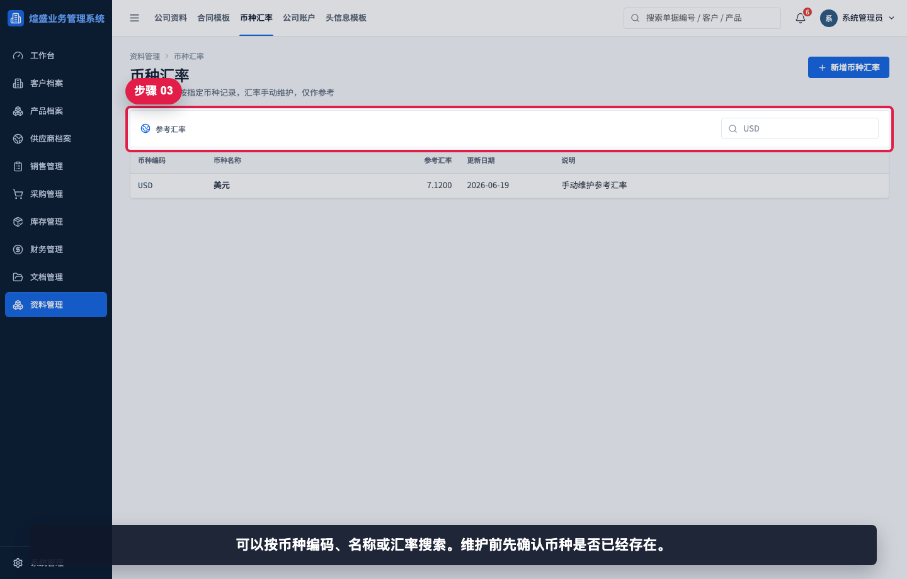
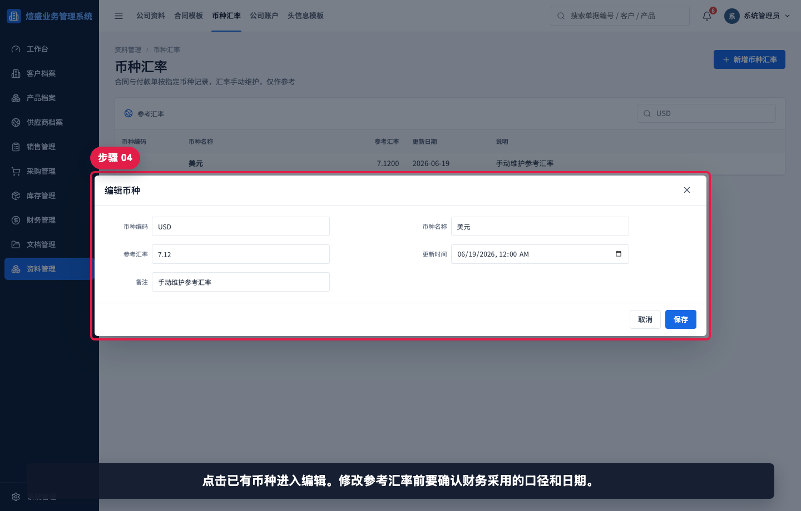
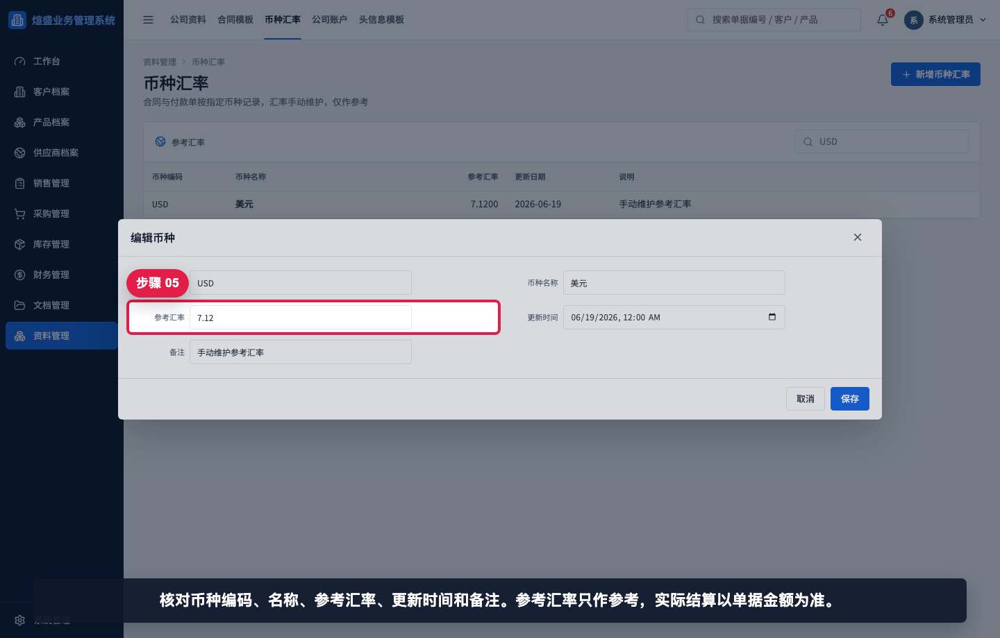
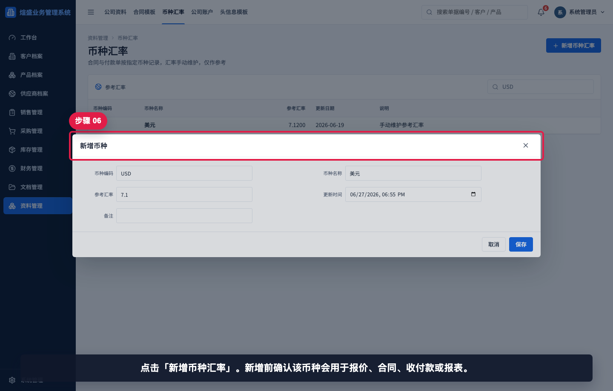
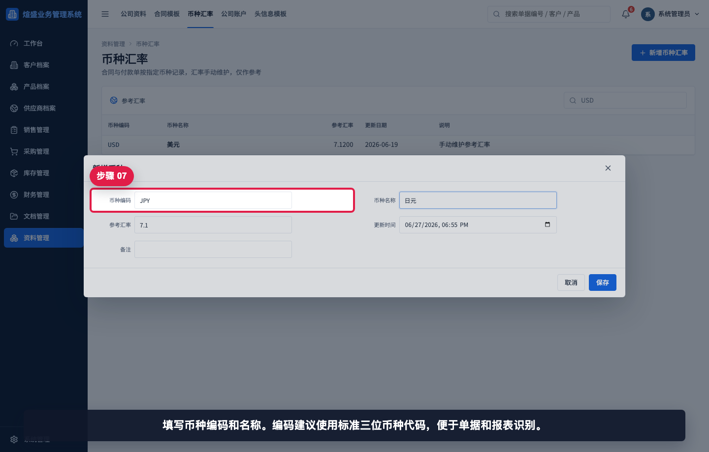
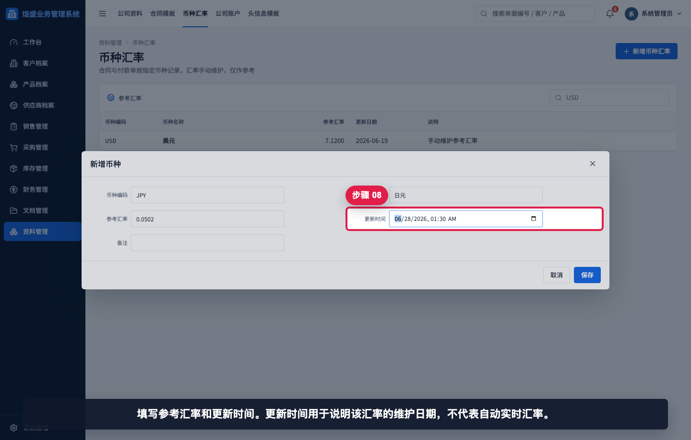
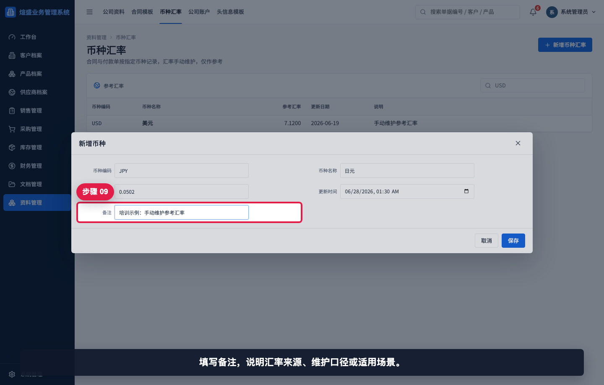
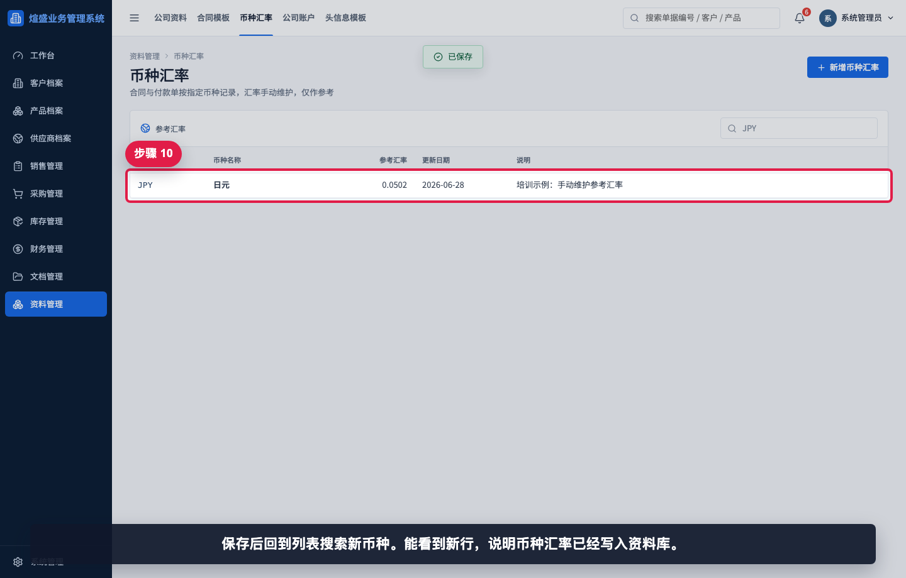

# 如何维护币种汇率

本指引用于培训管理员或财务关键用户维护币种汇率。系统中的合同和付款单按指定币种记录，汇率需要手动维护，仅作为业务和报表参考，实际结算金额仍以单据记录为准。

## 适用场景

- 新增业务会使用新的币种。
- 财务需要更新某个币种的参考汇率。
- 销售、采购或财务报表需要按参考汇率进行金额口径说明。
- 发现单据币种列表缺少某个币种，需要先维护基础资料。
- 月度或阶段性汇率口径调整，需要记录更新时间和说明。

## 字段填写说明

| 字段 | 填写方式 | 注意事项 |
|---|---|---|
| 币种编码 | 使用标准三位币种代码，例如 `USD`、`EUR`、`JPY` | 建议大写，避免重复 |
| 币种名称 | 填写中文名称，例如“美元”“欧元” | 便于业务用户识别 |
| 参考汇率 | 填写数字，可保留小数 | 仅作参考，不自动代表实时汇率 |
| 更新时间 | 填写汇率维护时间 | 用于说明汇率口径日期 |
| 备注 | 说明汇率来源或使用口径 | 便于财务复盘 |

## 步骤 01：进入币种汇率

进入“资料管理 / 币种汇率”。这里维护业务单据和报表使用的币种参考汇率。

## 步骤 02：查看币种列表

先查看币种列表。重点关注币种编码、币种名称、参考汇率、更新日期和说明。

## 步骤 03：搜索已有币种

可以按币种编码、名称或汇率搜索。维护前先确认币种是否已经存在。

## 步骤 04：打开已有币种

点击已有币种进入编辑。修改参考汇率前要确认财务采用的口径和日期。

## 步骤 05：核对币种字段

核对币种编码、名称、参考汇率、更新时间和备注。参考汇率只作参考，实际结算以单据金额为准。

## 步骤 06：新增币种

点击“新增币种汇率”。新增前确认该币种会用于报价、合同、收付款或报表。

## 步骤 07：填写币种编码和名称

填写币种编码和名称。编码建议使用标准三位币种代码，便于单据和报表识别。

## 步骤 08：填写汇率和更新时间

填写参考汇率和更新时间。更新时间用于说明该汇率的维护日期，不代表自动实时汇率。

## 步骤 09：填写汇率备注

填写备注，说明汇率来源、维护口径或适用场景。

## 步骤 10：保存后查看币种

保存后回到列表搜索新币种。能看到新行，说明币种汇率已经写入资料库。

## 相关教程

- [如何维护公司账户](../维护公司账户/README.md)
- [如何维护公司资料](../维护公司资料/README.md)
- [如何创建财务调整单](../../财务管理/创建财务调整单/README.md)
- [如何查看资金流水](../../看板报表/查看资金流水/README.md)

## 常见错误

- 把参考汇率当作自动实时汇率。当前系统为手动维护，仅作参考。
- 币种编码大小写或拼写不统一，导致搜索和单据识别困难。
- 更新汇率但忘记修改更新时间，后续无法判断口径日期。
- 缺少备注，财务复盘时无法确认汇率来源。
- 认为修改汇率会自动改历史单据金额。历史单据金额以单据记录为准。

## 保存前检查清单

- 币种编码是否为标准三位代码。
- 币种名称是否清晰可读。
- 参考汇率是否经过财务确认。
- 更新时间是否反映本次维护时间或口径日期。
- 备注是否说明汇率来源或适用范围。
- 保存后是否能在列表中搜索到该币种。
