# 如何创建采购合同

本指引用于培训新用户手工创建一张采购合同。示例覆盖进入采购合同列表、打开新增采购合同、选择供应商、填写采购产品、数量和买入单价、核对合同金额、核对供应商信息、采购方公司信息、供应商收款信息、采购交付与付款、附件和备注，以及保存并验证。

优先建议：常规销售履约应从“申购单下推采购合同”，这样采购数量来自系统计算的真实采购缺口。手工创建采购合同适用于补录历史合同、非销售缺口采购、特殊临时采购，或确实没有上游申购单的场景。

## 适用场景

- 历史采购合同需要补录到系统。
- 非销售合同缺口的临时采购需要登记。
- 供应商采购已经线下确认，需要手工建立采购执行合同。
- 上游申购单暂不存在，但采购、仓库和财务仍需要一张正式采购合同作为后续来源。

## 前置条件

- 供应商档案已建立，建议维护联系人、地址、税号和收款信息。
- 产品档案已建立，SKU、品名、规格、单位和产品类型完整。
- 采购数量、买入单价、币种、交付日期、交付地点和付款条件已确认。
- 供应商报价、盖章合同、邮件确认或补充协议等附件资料已准备好，或计划后续补充。

## 字段填写说明

| 字段 | 是否必填 | 填写方式 | 影响 |
|---|---|---|---|
| 供应商 | 必填 | 从供应商档案选择 | 决定采购合同对象、供应商信息、后续应付和付款追溯 |
| 单据日期 | 必填 | 默认当天，可按合同日期调整 | 采购合同记录和统计日期 |
| 交付日期 | 必填 | 填供应商承诺交货日期 | 供应商生产完成、提货和入库跟进参考 |
| 申购单 | 建议填写 | 有上游申购单时选择；手工场景可为空 | 保留采购合同与申购缺口的来源关系 |
| 币种 | 建议填写 | 如 CNY、USD | 决定买入单价、合同金额和应付币种 |
| 产品 / 费用 | 必填 | 从产品档案搜索选择 | 后续提货、入库、采购发票和付款追溯依赖产品行 |
| 数量 | 必填 | 按供应商确认采购数量填写 | 影响提货、入库和应付数量 |
| 买入单价 | 必填 | 按供应商确认采购价填写 | 计算采购合同金额，影响采购分析和应付 |
| 供应商信息 | 建议核对 | 展开后核对供应商名称、联系人、电话、邮箱和地址 | 合同导出、供应商沟通和对账使用 |
| 采购方公司信息 | 必填项需完整 | 默认从公司资料带出 | 采购合同主体信息，保存校验会检查采购方名称 |
| 供应商收款信息 | 建议核对 | 默认从供应商档案带出 | 后续付款和供应商对账参考 |
| 交付地点 | 必填 | 填实际收货或交付地点 | 保存采购合同的必要字段 |
| 付款条件 | 建议填写 | 填预付款、尾款、账期等 | 付款安排和财务交接依据 |
| 合同附件 | 按需上传 | 上传报价、盖章采购合同、补充协议等 | 文档归档和审计追溯 |
| 备注 | 按需填写 | 写手工创建原因、价格确认、交付付款安排 | 便于采购、仓库和财务追溯 |
| 保存状态 | 必填 | 草稿 / 已确认 | 已确认后才能作为正式采购事实并继续下推提货通知 |

## 步骤 01：进入采购合同列表

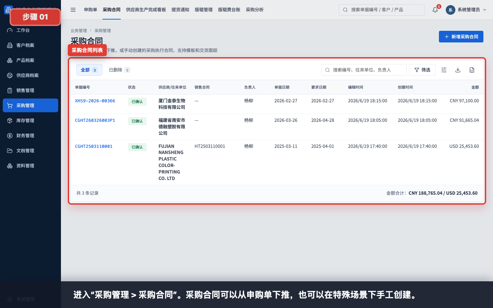

进入“采购管理 > 采购合同”。这里既能查看从申购单下推的采购合同，也能手工创建采购合同。

## 步骤 02：打开新增采购合同

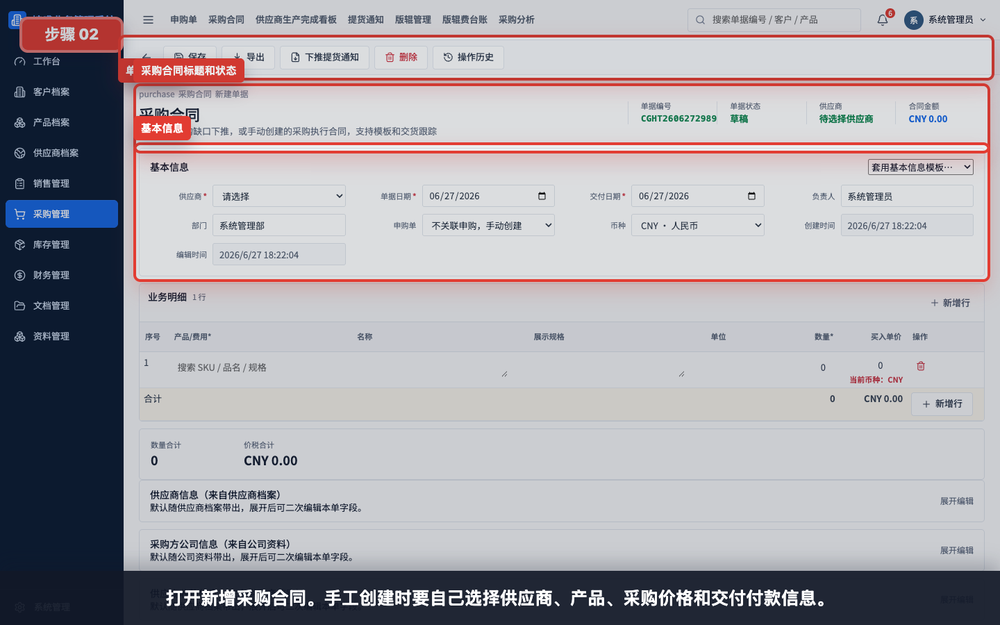

打开新增采购合同。手工创建时，需要自己选择供应商、产品、采购价格和交付付款信息。

## 步骤 03：选择供应商和基本信息

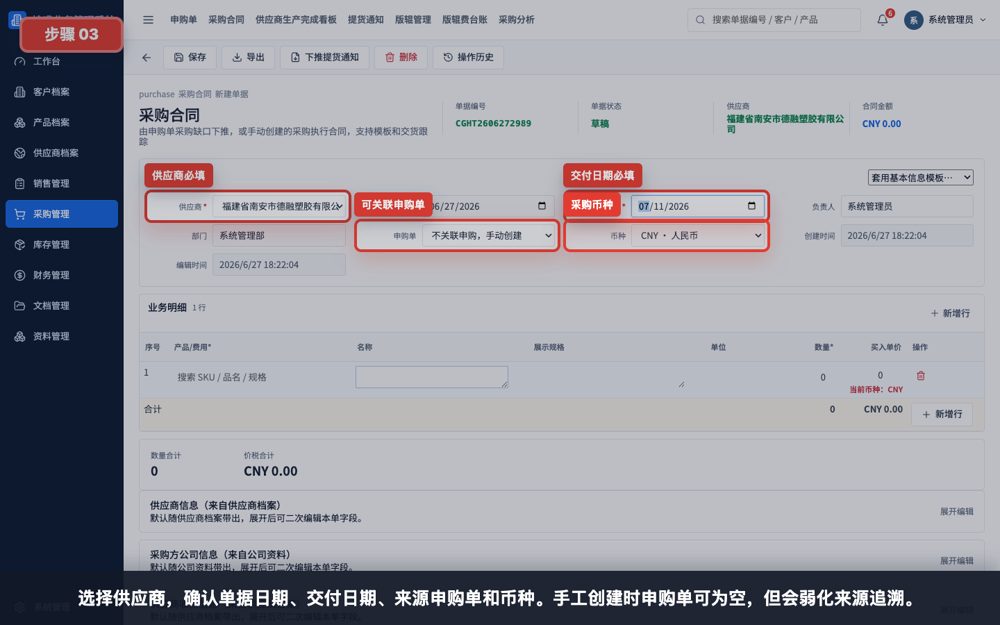

选择供应商，确认单据日期、交付日期、来源申购单和币种。手工创建时申购单可以为空，但会弱化来源追溯。

填写建议：

- 供应商必须从供应商档案选择。
- 交付日期应与供应商承诺交付日期一致。
- 有上游申购单时尽量关联申购单。
- 币种应与供应商报价和付款币种一致。

## 步骤 04：搜索并选择采购产品

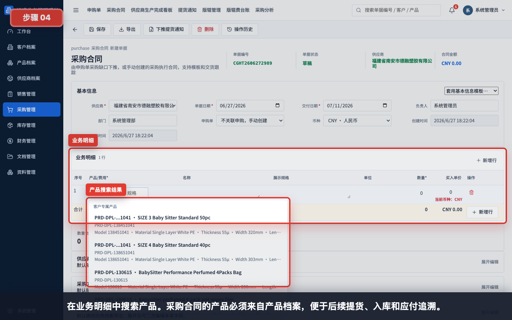

在业务明细中搜索产品。采购合同的产品必须来自产品档案，便于后续提货、入库、采购发票和付款追溯。

## 步骤 05：填写采购数量和买入单价

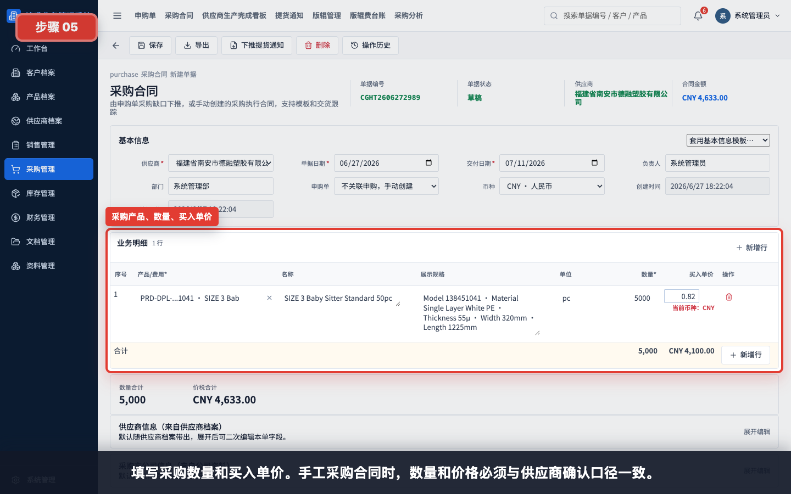

填写采购数量和买入单价。手工采购合同时，数量和价格必须与供应商确认口径一致。

示例：

| 字段 | 示例 |
|---|---|
| 采购数量 | 5,000 |
| 买入单价 | 0.82 |
| 币种 | CNY |

## 步骤 06：核对采购合同金额

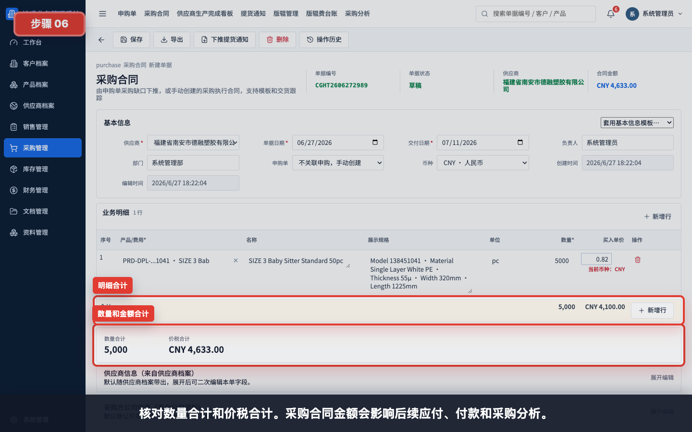

核对数量合计和价税合计。采购合同金额会影响后续应付、付款和采购分析。

核对重点：

- 产品、规格和单位是否正确。
- 数量是否与供应商确认数量一致。
- 买入单价和币种是否与供应商报价一致。
- 合同金额是否符合含税或未税口径。

## 步骤 07：核对供应商信息

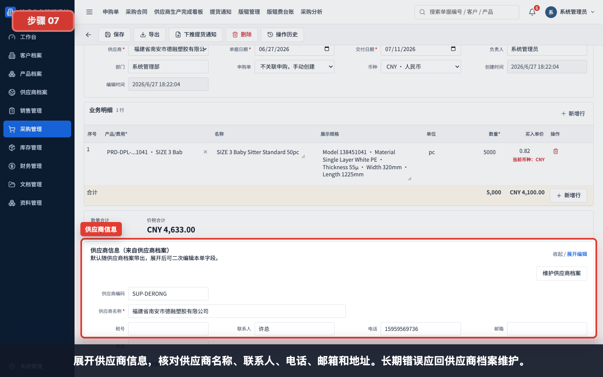

展开供应商信息，核对供应商名称、联系人、电话、邮箱和地址。当前单据可二次编辑；如果是长期资料错误，应回供应商档案维护。

## 步骤 08：核对采购方公司信息

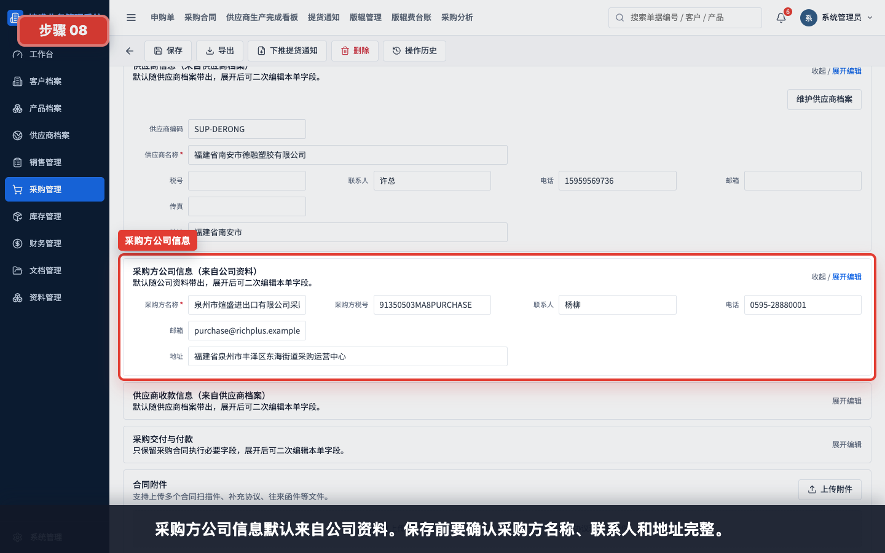

采购方公司信息默认来自公司资料。保存前要确认采购方名称、联系人和地址完整。

## 步骤 09：核对供应商收款信息

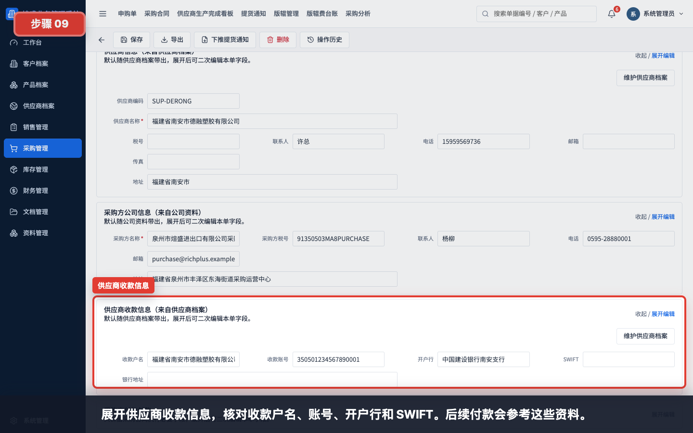

展开供应商收款信息，核对收款户名、账号、开户行和 SWIFT。后续付款会参考这些资料。

## 步骤 10：填写采购交付与付款

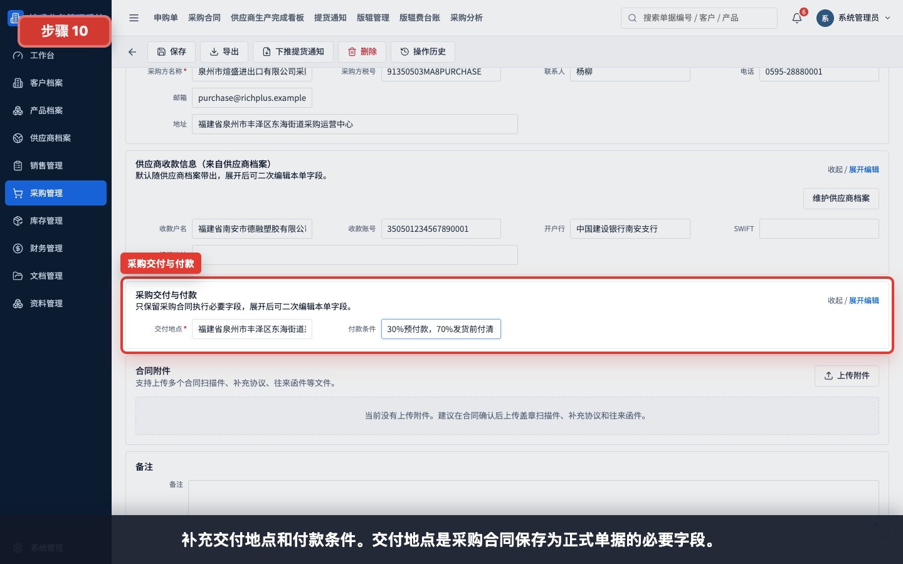

补充交付地点和付款条件。交付地点是采购合同保存为正式单据的必要字段。

示例：

| 字段 | 示例 |
|---|---|
| 交付地点 | 厦门仓库 |
| 付款条件 | 30%预付款，70%发货前付清 |

## 步骤 11：查看合同附件区域

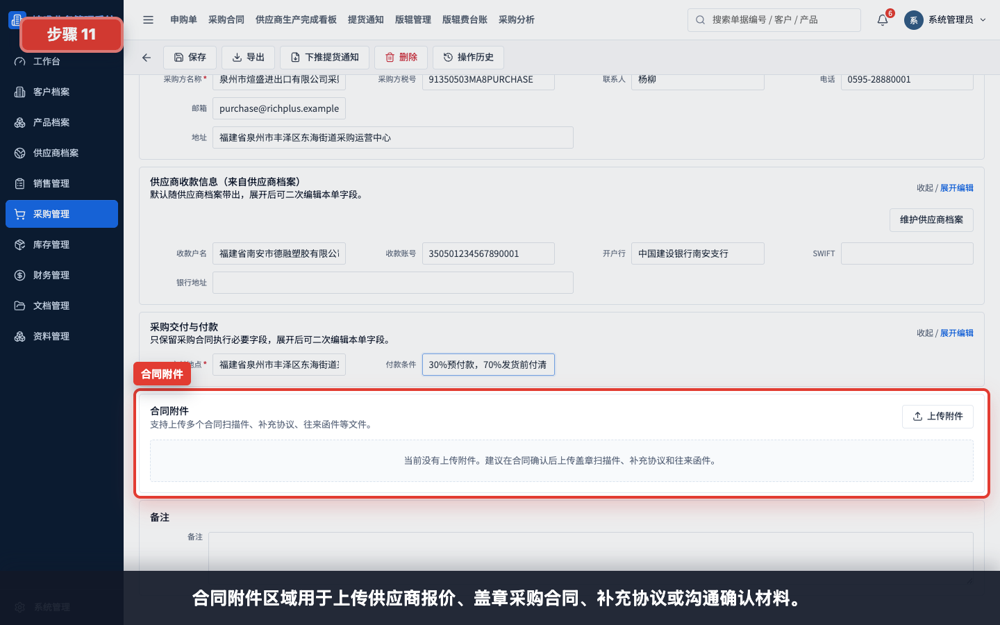

合同附件区域用于上传供应商报价、盖章采购合同、补充协议或沟通确认材料。新建时可先保存，再补充附件。

建议上传：

- 供应商报价单。
- 盖章采购合同。
- 邮件确认截图或 PDF。
- 补充协议、交付变更或付款确认材料。

## 步骤 12：填写备注并保存

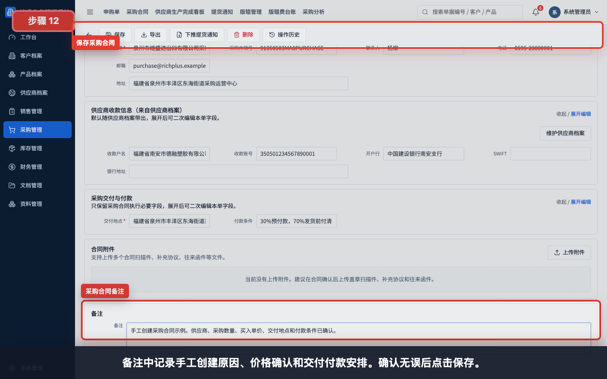

备注中记录手工创建原因、价格确认和交付付款安排。确认无误后点击保存。

备注示例：

```text
手工创建采购合同示例。供应商、采购数量、买入单价、交付地点和付款条件已确认。
```

## 步骤 13：选择保存状态

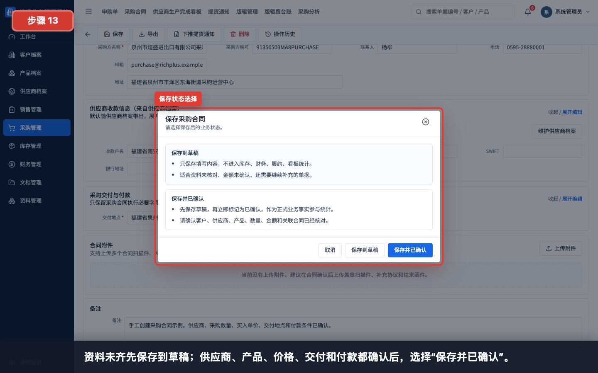

资料未齐先保存到草稿；供应商、产品、价格、交付和付款都确认后，选择“保存并已确认”。

状态说明：

| 状态 | 适用情况 | 后续影响 |
|---|---|---|
| 保存到草稿 | 供应商、价格或交付付款条件仍需复核 | 不建议进入提货和入库流程 |
| 保存并已确认 | 采购执行条件已确认 | 可下推提货通知，并参与采购、履约和应付统计 |

## 步骤 14：回到采购合同列表验证

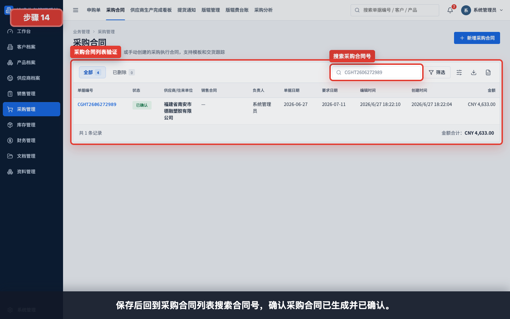

保存后回到“采购管理 > 采购合同”，搜索采购合同号，确认采购合同已生成并已确认。

## 步骤 15：查看下推提货通知入口

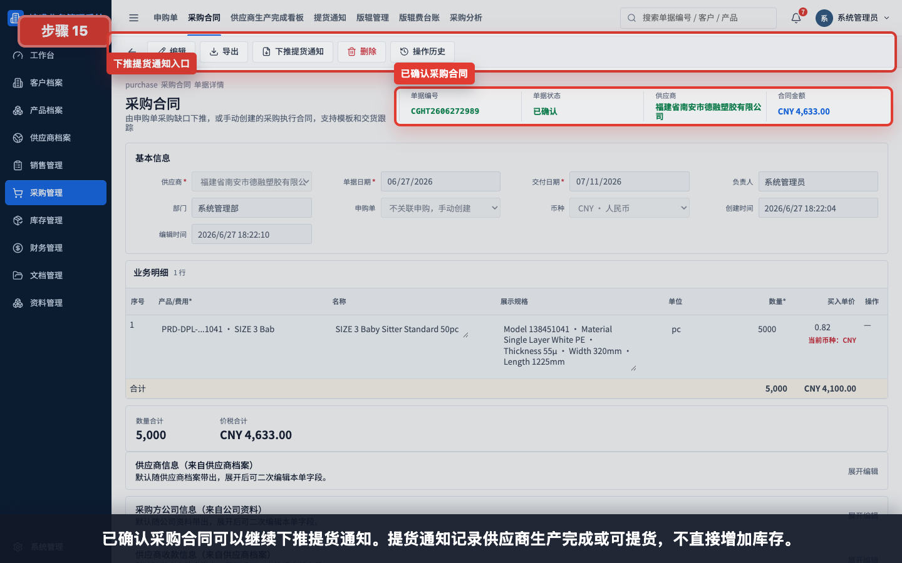

已确认采购合同可以继续下推提货通知。提货通知记录供应商生产完成或可提货，不直接增加库存。

## 常见错误

- 常规销售履约场景下手工创建采购合同，导致采购数量缺少申购缺口依据。
- 没有选择供应商，导致采购合同无法保存为正式单据。
- 产品没有从产品档案选择，后续提货、入库和应付无法稳定追溯。
- 采购数量与供应商确认数量不一致。
- 买入单价未填写、币种选错，导致合同金额和应付错误。
- 交付地点为空，保存并确认时校验不通过。
- 供应商收款信息未核对，后续付款时容易出错。
- 附件未上传，后续归档、审计或供应商争议时缺少依据。
- 采购合同只保存为草稿，忘记保存并已确认，后续无法稳定下推提货通知。

## 保存前检查清单

- 供应商已选择，供应商信息已核对。
- 如有上游申购单，已正确关联申购单。
- 产品、规格、单位、数量和买入单价已核对。
- 币种和合同金额已核对。
- 采购方公司信息完整。
- 供应商收款信息已核对。
- 交付日期、交付地点和付款条件已确认。
- 附件已上传或已安排后续补充。
- 备注已写清手工创建原因、价格和交付付款安排。
- 确认可以进入供应商执行后，选择“保存并已确认”。

