# 如何从申购单下推采购合同

本指引用于培训新用户把已确认申购单下推为采购合同。示例覆盖查找申购单、核对采购缺口、阅读下推确认、生成采购合同草稿、选择供应商、填写买入单价、补充交付地点和付款条件、保存并确认采购合同，以及验证后续可下推提货通知。

## 适用场景

- 申购单已经确认采购缺口，需要采购向供应商发起采购执行。
- 销售合同需求中已有库存不足，系统已经计算出需采购数量。
- 采购需要基于申购单生成采购合同，保留销售合同、申购单和采购合同之间的来源追溯。
- 需要避免把已被库存承接的数量重复采购。

## 前置条件

- 申购单已保存并已确认。
- 申购单中每个产品的需求总数、可申购库存和需采购数量已经核对。
- 供应商档案已建立，建议提前维护联系人、地址、税号和收款信息。
- 供应商报价、买入单价、交付日期、交付地点和付款条件已经线下确认或准备录入。

## 字段填写说明

| 字段 | 是否必填 | 填写方式 | 影响 |
|---|---|---|---|
| 供应商 | 必填 | 从供应商档案选择 | 决定采购合同对象、供应商信息、后续应付和付款追溯 |
| 单据日期 | 必填 | 默认当天，可按合同日期调整 | 采购合同记录和统计日期 |
| 交付日期 | 必填 | 填供应商承诺交货日期 | 供应商生产完成、提货和入库跟进参考 |
| 申购单 | 建议保留 | 下推时自动带出 | 保留采购合同与申购单之间的来源关系 |
| 币种 | 建议填写 | 如 CNY、USD | 决定买入单价、合同金额和应付币种 |
| 产品 / 费用 | 必填 | 下推时从申购单带出 | 采购合同只应承接需采购数量 |
| 数量 | 必填 | 系统从申购单的需采购数量带出 | 采购、提货、入库和应付的数量基础 |
| 买入单价 | 必填 | 填供应商确认采购价 | 计算采购合同金额，影响采购分析和应付 |
| 供应商信息 | 建议核对 | 展开供应商信息区查看 | 影响合同导出、供应商沟通和对账 |
| 采购方公司信息 | 建议核对 | 默认从公司资料带出 | 影响采购合同主体信息 |
| 供应商收款信息 | 建议核对 | 默认从供应商档案带出 | 后续付款和对账参考 |
| 交付地点 | 必填 | 填实际收货或交付地点 | 保存采购合同的必要字段 |
| 付款条件 | 建议填写 | 填预付款、尾款、账期等 | 后续付款安排和内部交接依据 |
| 备注 | 按需填写 | 写来源、价格确认、交付付款安排 | 便于采购、仓库和财务追溯 |
| 保存状态 | 必填 | 草稿 / 已确认 | 已确认后才能作为正式采购事实并继续下推提货通知 |

核心规则：

```text
采购合同数量 = 申购单需采购数量
```

注意：采购合同不会复制申购单中的可申购库存数量。可申购库存代表已有库存承接部分，不应重复采购。

## 步骤 01：找到已确认申购单

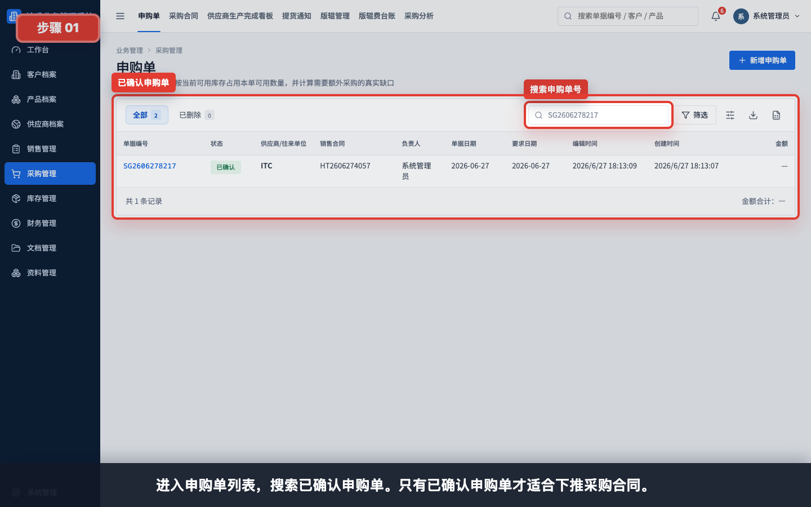

进入“采购管理 > 申购单”，搜索需要执行采购的申购单号。只有已确认申购单才适合下推采购合同。

检查重点：

- 单据状态是否为已确认。
- 来源销售合同是否正确。
- 需求总数和需采购数量是否符合业务预期。

## 步骤 02：打开申购单详情

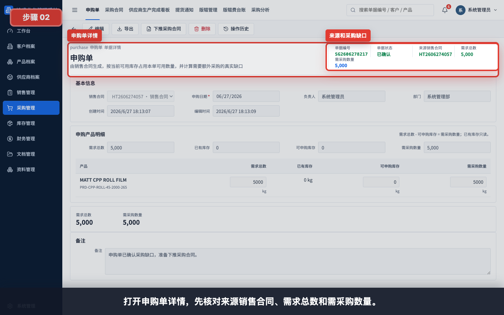

打开申购单详情，先核对来源销售合同、需求总数和需采购数量。采购合同会从这里承接采购缺口。

## 步骤 03：核对申购采购缺口

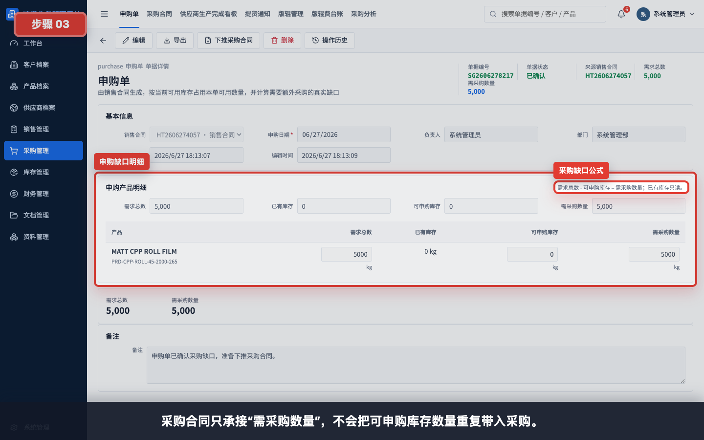

核对产品行中的需求总数、已有库存、可申购库存和需采购数量。采购合同只应承接“需采购数量”。

示例：

| 字段 | 示例 |
|---|---|
| 需求总数 | 5,000 |
| 可申购库存 | 0 |
| 需采购数量 | 5,000 |

## 步骤 04：确认下推采购合同入口

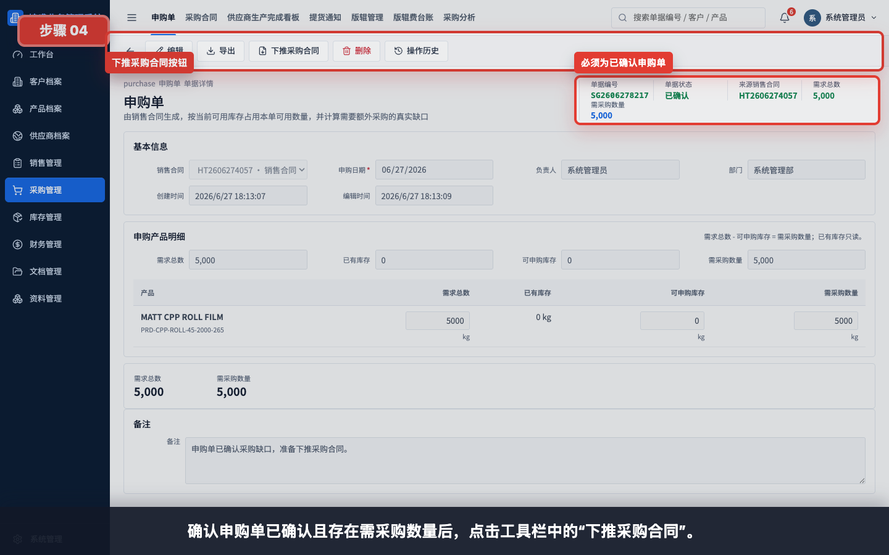

确认申购单已确认且存在需采购数量后，点击工具栏中的“下推采购合同”。

## 步骤 05：查看下推采购合同确认

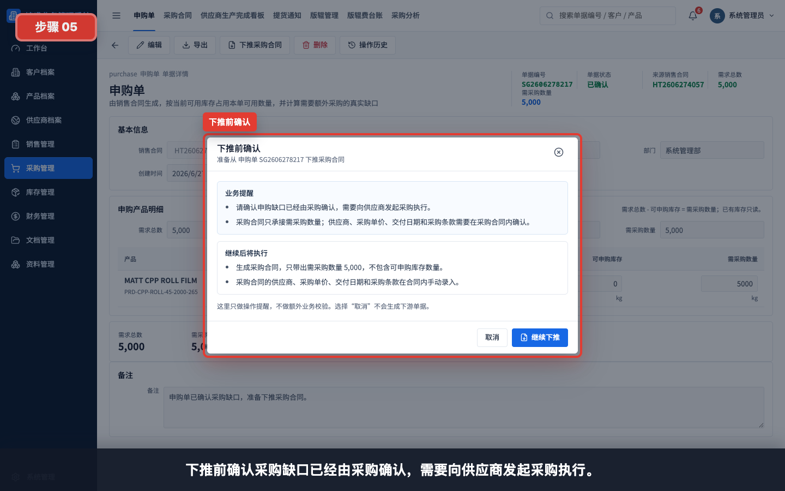

下推前先阅读业务提醒：申购缺口应已经由采购确认，需要向供应商发起采购执行。

## 步骤 06：确认采购合同只承接缺口

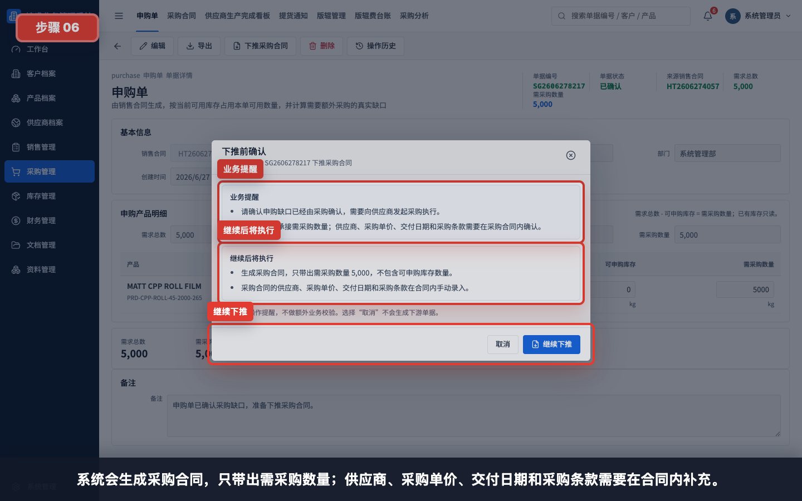

系统会提示：采购合同只带出需采购数量，不包含可申购库存数量；供应商、采购单价、交付日期和采购条款需要在合同内手动录入。

## 步骤 07：生成采购合同草稿

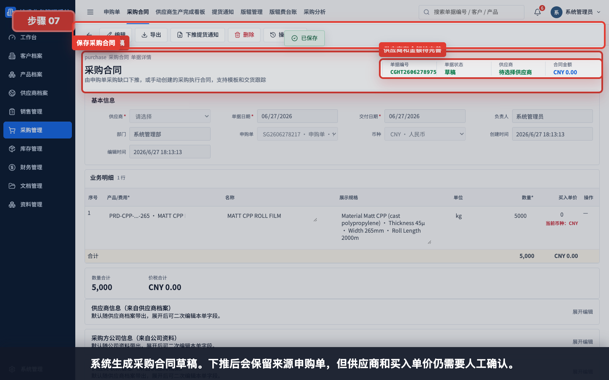

继续下推后，系统生成采购合同草稿。此时来源申购单已经保留，但供应商和买入单价仍需要人工确认。

## 步骤 08：补充供应商和基础信息

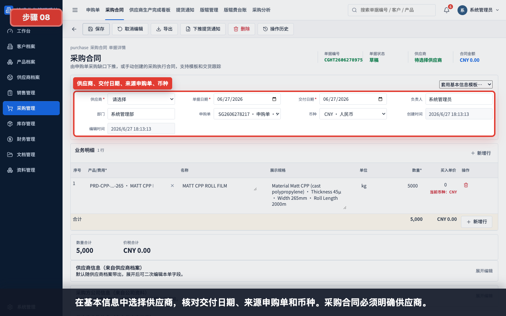

点击编辑后，在基本信息中选择供应商，核对交付日期、来源申购单和币种。

填写建议：

- 供应商必须从供应商档案选择。
- 交付日期应与供应商承诺交付日期一致。
- 币种应与供应商报价和付款币种一致。
- 申购单来源不要随意清空，避免丢失追溯关系。

## 步骤 09：选择供应商后核对带出信息

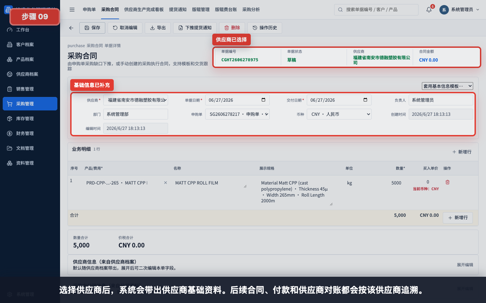

选择供应商后，系统会带出供应商基础资料。后续合同、付款和供应商对账都会按该供应商追溯。

## 步骤 10：核对采购产品和缺口数量

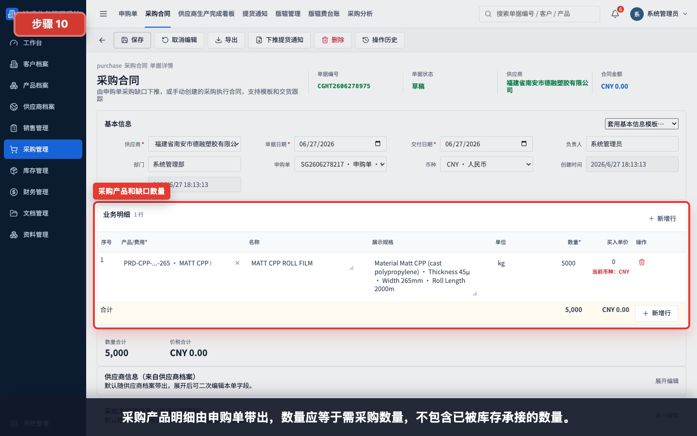

采购产品明细由申购单带出，数量应等于需采购数量。不要把销售合同需求总数或已有库存数量手工改入采购合同。

## 步骤 11：填写买入单价并核对金额

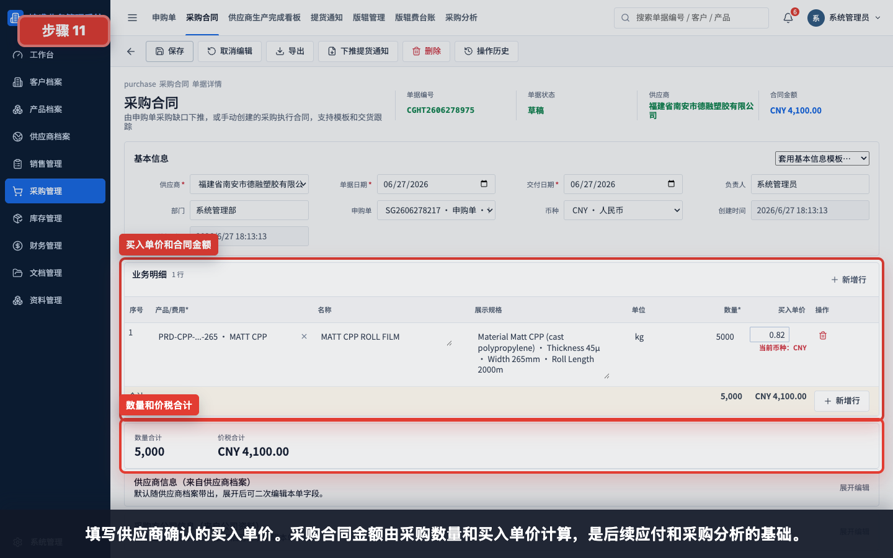

填写供应商确认的买入单价。采购合同金额由采购数量和买入单价计算，是后续应付、付款和采购分析的基础。

核对重点：

- 买入单价是否与供应商报价一致。
- 币种是否正确。
- 数量是否等于申购单需采购数量。
- 合同金额是否符合采购确认口径。

## 步骤 12：填写采购交付与付款

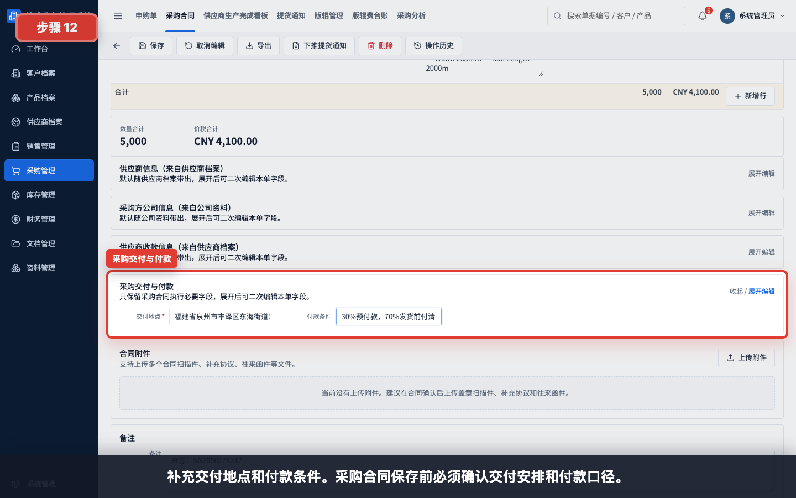

展开“采购交付与付款”，填写交付地点和付款条件。采购合同保存前必须确认交付安排和付款口径。

示例：

| 字段 | 示例 |
|---|---|
| 交付地点 | 厦门仓库 |
| 付款条件 | 30%预付款，70%发货前付清 |

## 步骤 13：核对供应商信息

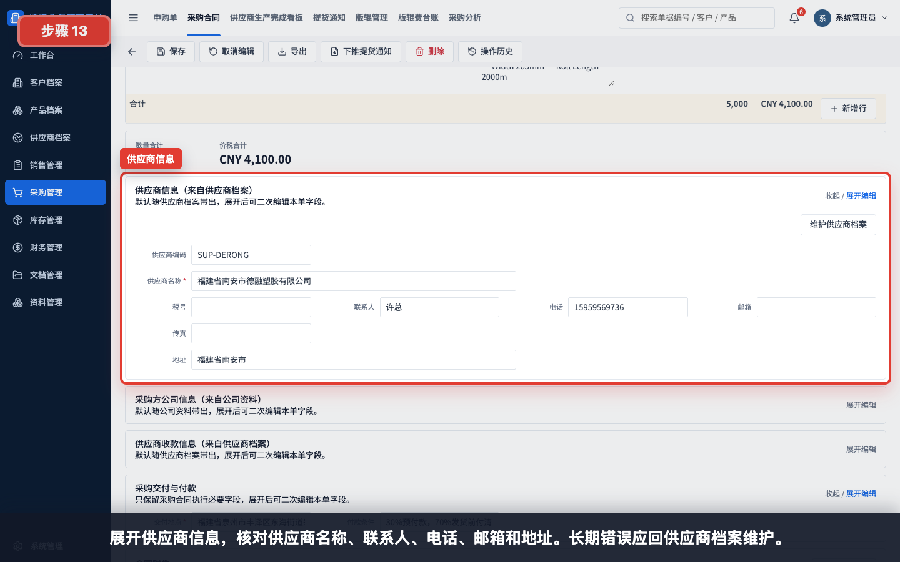

展开供应商信息，核对供应商名称、联系人、电话、邮箱和地址。当前单据可二次编辑；如果是长期资料错误，应回供应商档案维护。

## 步骤 14：填写备注并保存采购合同

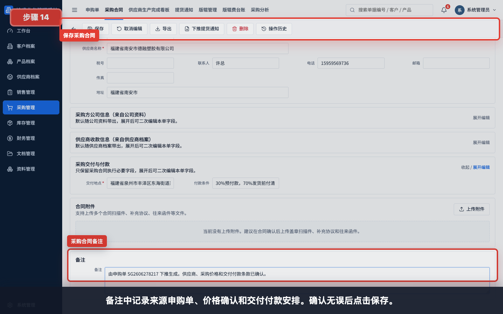

在备注中记录来源申购单、价格确认、交付和付款安排。确认无误后点击保存。

备注示例：

```text
由申购单 SG2606278217 下推生成。供应商、采购价格和交付付款条款已确认。
```

## 步骤 15：保存并确认采购合同

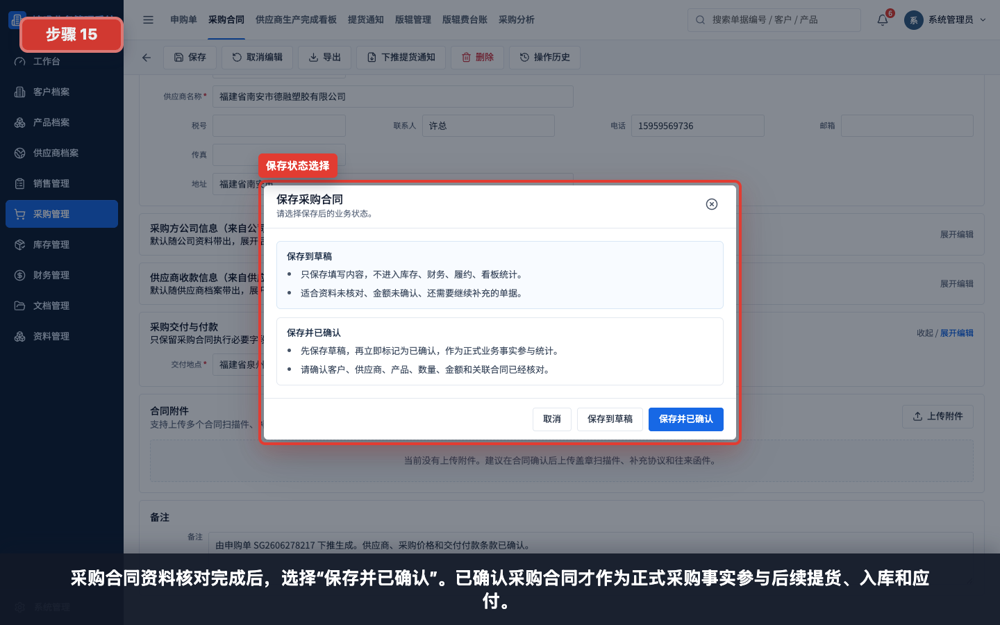

资料未齐时可以先保存到草稿；供应商、产品、数量、买入单价、交付地点和付款条件确认后，选择“保存并已确认”。

状态说明：

| 状态 | 适用情况 | 后续影响 |
|---|---|---|
| 保存到草稿 | 供应商、价格或交付付款条件仍需复核 | 不建议进入提货和入库流程 |
| 保存并已确认 | 采购执行条件已确认 | 可下推提货通知，并参与采购、履约和应付统计 |

## 步骤 16：回到采购合同列表验证

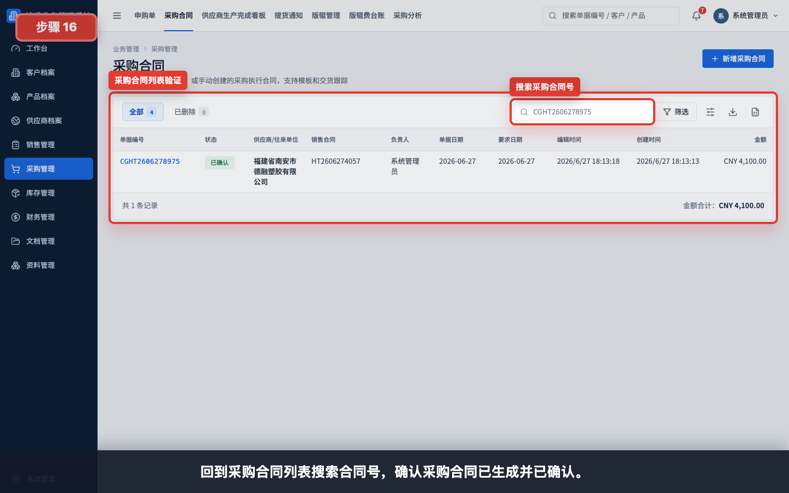

保存后回到“采购管理 > 采购合同”，搜索采购合同号，确认采购合同已生成并已确认。

## 步骤 17：查看下推提货通知入口

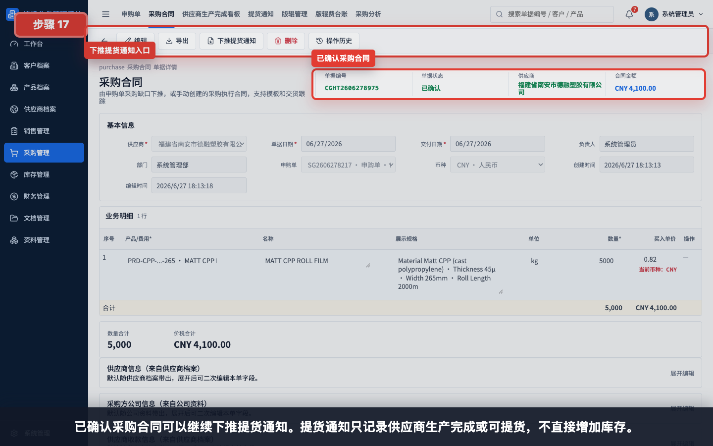

已确认采购合同可以继续下推提货通知。提货通知只记录供应商生产完成或可提货，不直接增加库存。

## 常见错误

- 申购单仍是草稿就下推采购合同，导致采购流程缺少正式采购缺口依据。
- 没有核对需采购数量，把销售合同总需求或库存承接数量重复采购。
- 下推后忘记选择供应商，导致采购合同无法正式保存。
- 买入单价未填写或币种错误，导致合同金额、应付和采购分析不准确。
- 交付地点为空，采购合同保存校验不通过。
- 付款条件没有写清，后续付款安排和财务交接不明确。
- 手工新建采购合同而不是从申购单下推，导致销售合同、申购单和采购合同之间缺少追溯。
- 采购合同只保存为草稿，忘记保存并已确认，后续无法稳定下推提货通知。

## 保存前检查清单

- 申购单状态为已确认。
- 采购合同来源申购单正确。
- 供应商已选择，供应商信息已核对。
- 产品、规格、单位和数量与申购单需采购数量一致。
- 买入单价、币种和合同金额已核对。
- 交付日期、交付地点和付款条件已确认。
- 备注已写清来源、价格和交付付款安排。
- 确认可以进入供应商执行后，选择“保存并已确认”。

