# 如何从采购合同下推提货通知

本指引用于培训新用户把已确认采购合同下推为提货通知单。示例覆盖查找采购合同、核对采购产品、阅读下推确认、生成提货通知草稿、核对来源采购合同、填写本次 ready / 待提货数量、保存并确认、查看供应商生产完成看板，以及验证后续可下推入库单。

## 适用场景

- 供应商通知货物已经生产完成，可以安排提货。
- 供应商只完成部分数量，需要分批登记 ready / 待提货。
- 采购和仓库需要知道哪些采购合同已经 ready，哪些还未实际入库。
- 需要在入库前保留“生产完成 / 待提货”的中间状态。

## 前置条件

- 采购合同已保存并已确认。
- 供应商、采购产品、数量、买入单价、交付日期和交付地点已确认。
- 供应商已经明确生产完成数量或可提货数量。
- 仓库或物流已准备跟进实际提货、到货和入库。

## 字段填写说明

| 字段 | 是否必填 | 填写方式 | 影响 |
|---|---|---|---|
| 供应商/货代 | 必填 | 从采购合同自动带出 | 后续提货、待入库和供应商看板按供应商追溯 |
| 单据日期 | 必填 | 默认当天，可按通知日期调整 | 提货通知记录日期 |
| 要求日期 | 必填 | 可理解为预计 ready / 提货日期 | 供应商生产完成和待入库跟进参考 |
| 来源单号 | 必填 | 由采购合同下推自动带出 | 提货通知必须关联采购合同 |
| 关联销售合同 | 只读/自动 | 有销售来源时自动带入 | 支持从销售合同追溯采购和入库进度 |
| 币种 | 建议保留 | 从采购合同带出 | 保持金额口径一致 |
| 产品 / 费用 | 必填 | 从采购合同带出 | 提货通知只登记实物产品 ready / 待提货 |
| 数量 | 必填 | 填本次供应商已生产完成或待提货数量 | 进入供应商生产完成看板和待入库统计 |
| 买入单价 | 自动带出 | 从采购合同带出 | 用于参考金额；提货通知本身不触发应付 |
| 备注 | 按需填写 | 写供应商 ready 通知、分批数量和提货安排 | 便于采购、仓库和物流交接 |
| 保存状态 | 必填 | 草稿 / 已确认 | 已确认后进入生产完成看板，并可继续下推入库单 |

关键规则：

```text
提货通知 = 供应商已生产完成 / 待提货
提货通知不会增加库存，也不会触发应付
库存增加事实 = 采购入库单
```

## 步骤 01：找到已确认采购合同

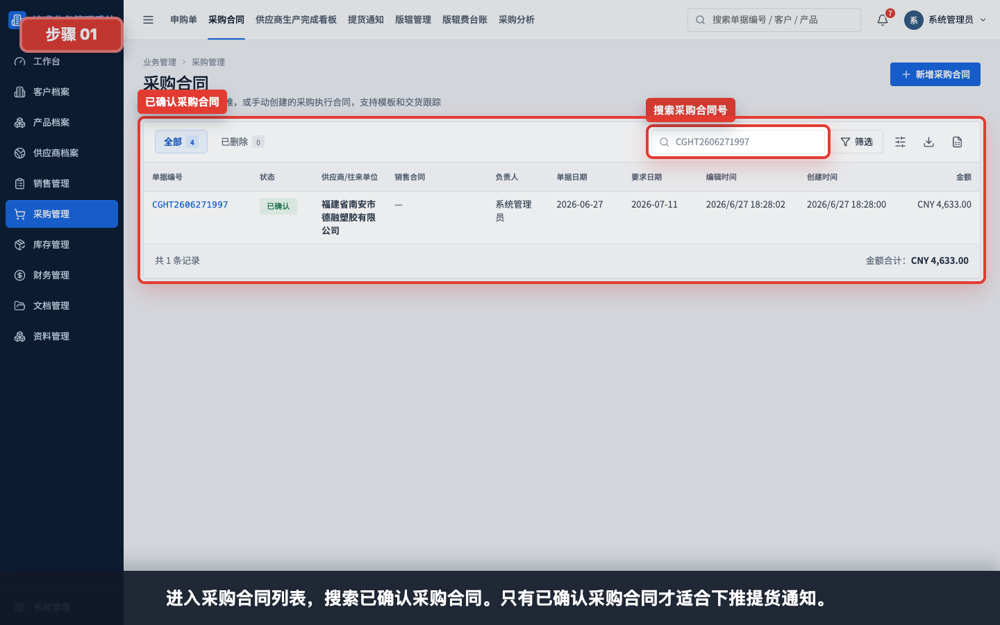

进入“采购管理 > 采购合同”，搜索需要登记 ready 的采购合同。只有已确认采购合同才适合下推提货通知。

## 步骤 02：打开采购合同详情

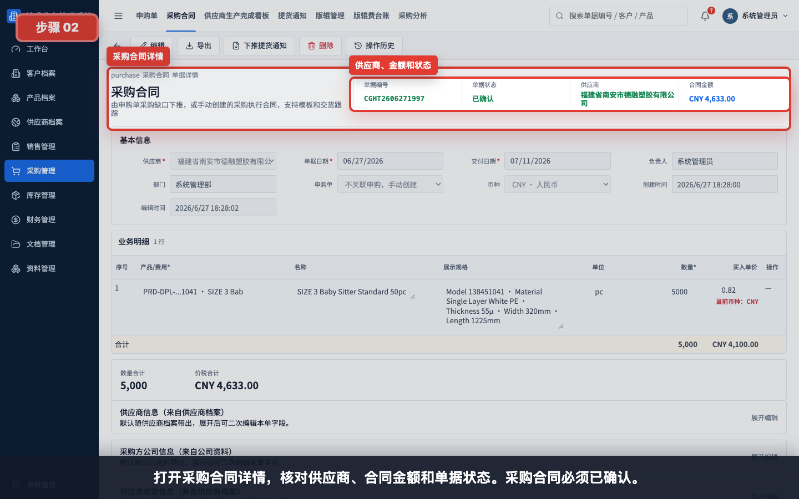

打开采购合同详情，核对供应商、合同金额和单据状态。确认采购合同已经进入正式采购执行。

## 步骤 03：核对采购产品和数量

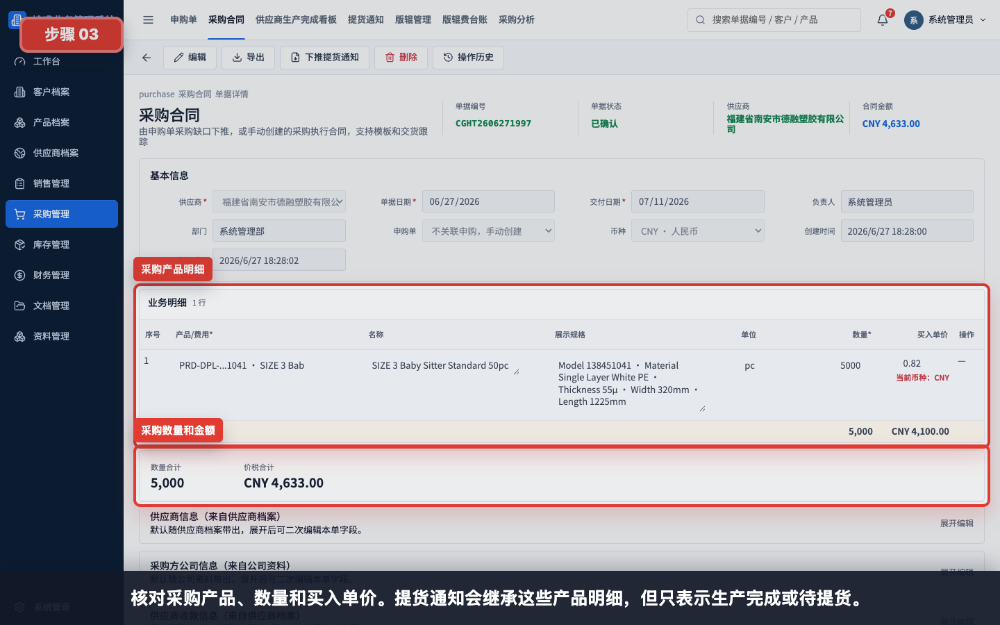

核对采购产品、数量和买入单价。提货通知会继承这些产品明细，但只表示供应商生产完成或待提货。

## 步骤 04：确认下推提货通知入口

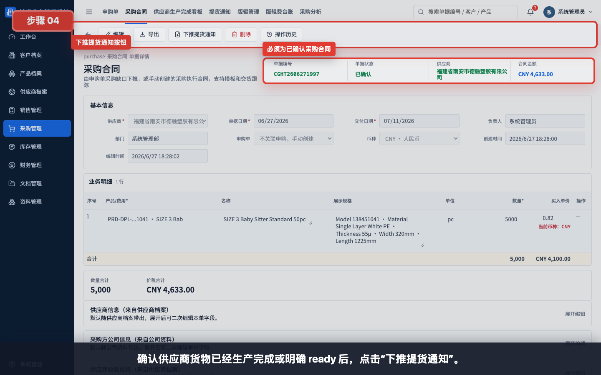

确认供应商货物已经生产完成或明确 ready 后，点击工具栏中的“下推提货通知”。

## 步骤 05：查看下推提货通知确认

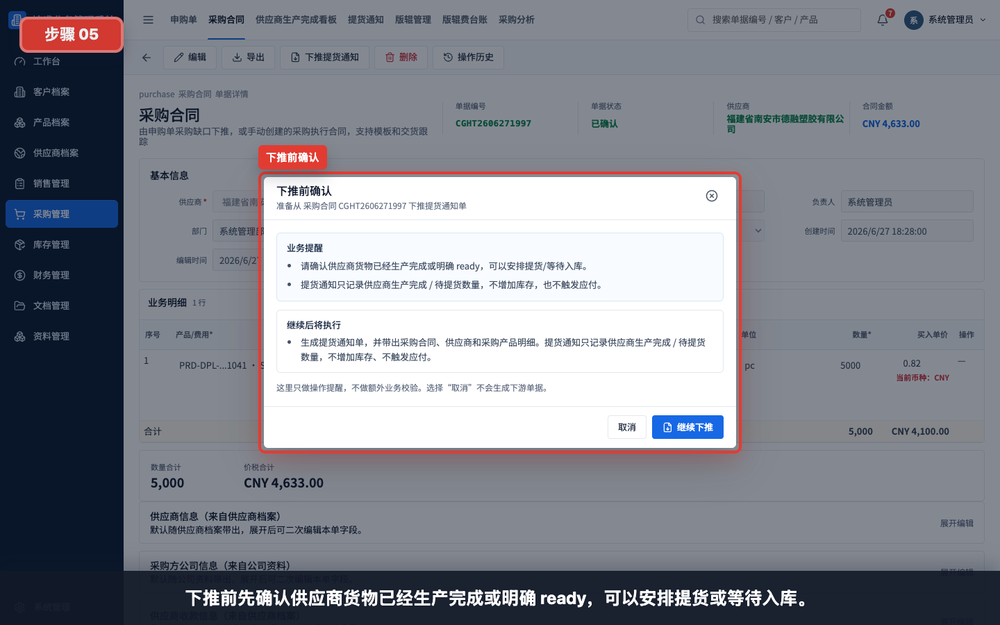

下推前先阅读业务提醒：供应商货物应已经生产完成或明确 ready，可以安排提货或等待入库。

## 步骤 06：确认提货通知不增加库存

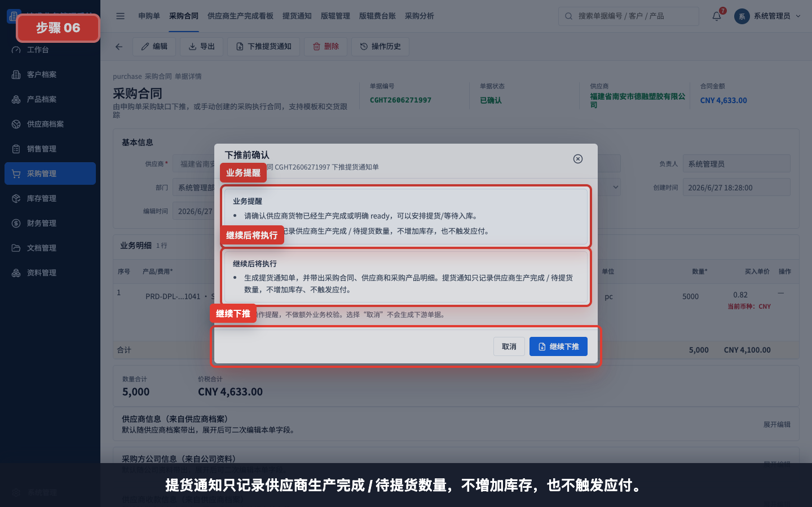

系统会提示：提货通知只记录供应商生产完成 / 待提货数量，不增加库存，也不触发应付。

## 步骤 07：生成提货通知草稿

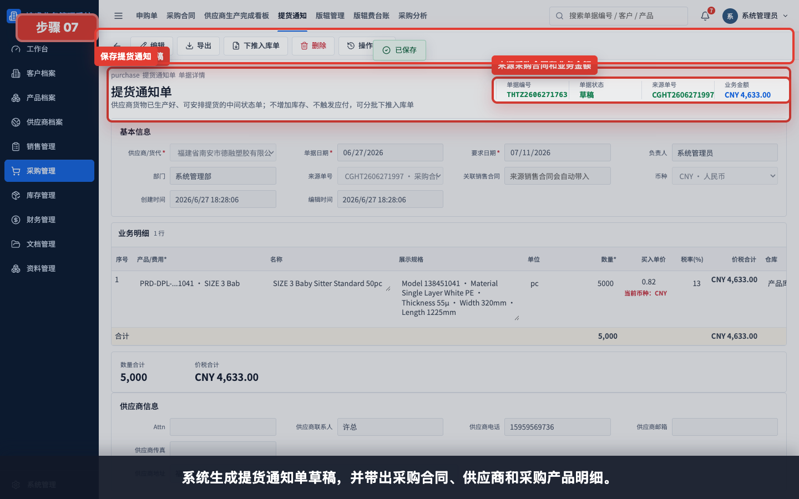

继续下推后，系统生成提货通知单草稿，并带出采购合同、供应商和采购产品明细。

## 步骤 08：核对来源采购合同和基本信息

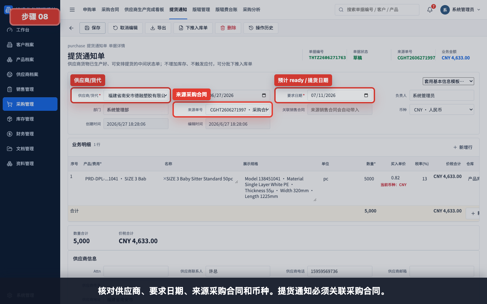

核对供应商、要求日期、来源采购合同和币种。提货通知必须关联采购合同，否则后续入库和追溯会断开。

## 步骤 09：核对本次 ready 产品数量

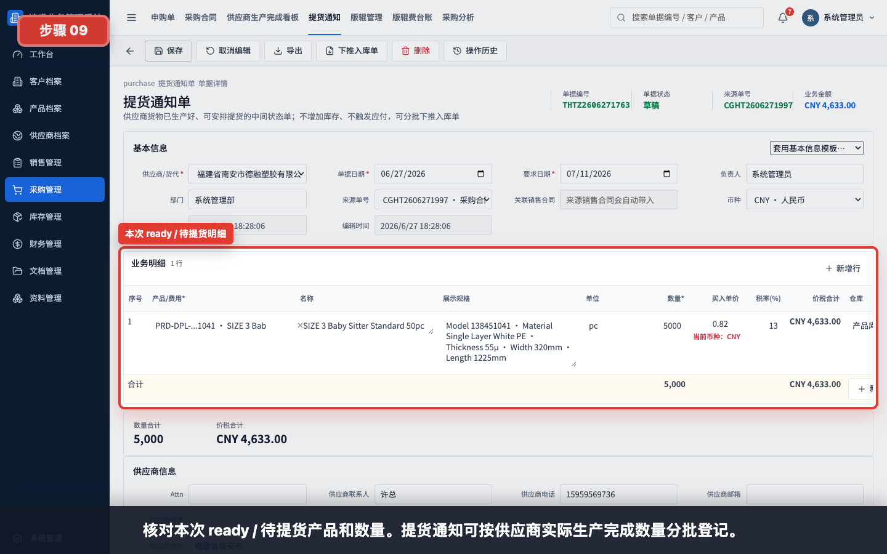

核对本次 ready / 待提货产品和数量。如果供应商一次性完成全部数量，可保持采购合同带出的数量。

## 步骤 10：填写本次部分 ready 数量

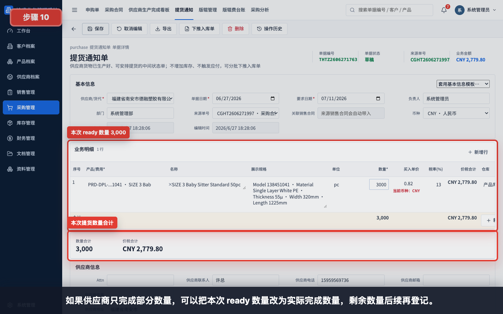

如果供应商只完成部分数量，可以把本次 ready 数量改为实际完成数量，剩余数量后续再登记。

示例：

| 字段 | 示例 |
|---|---|
| 采购合同数量 | 5,000 |
| 本次 ready 数量 | 3,000 |
| 剩余待生产 / 待登记 | 2,000 |

## 步骤 11：填写备注并保存提货通知

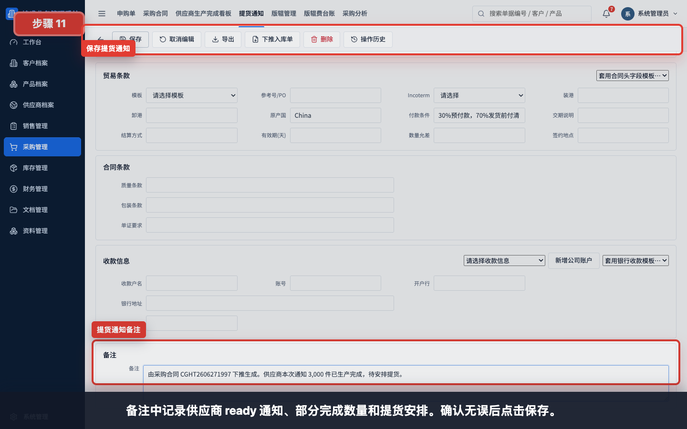

备注中记录供应商 ready 通知、部分完成数量和提货安排。确认无误后点击保存。

备注示例：

```text
由采购合同 CGHT2606271997 下推生成。供应商本次通知 3,000 件已生产完成，待安排提货。
```

## 步骤 12：保存并确认提货通知

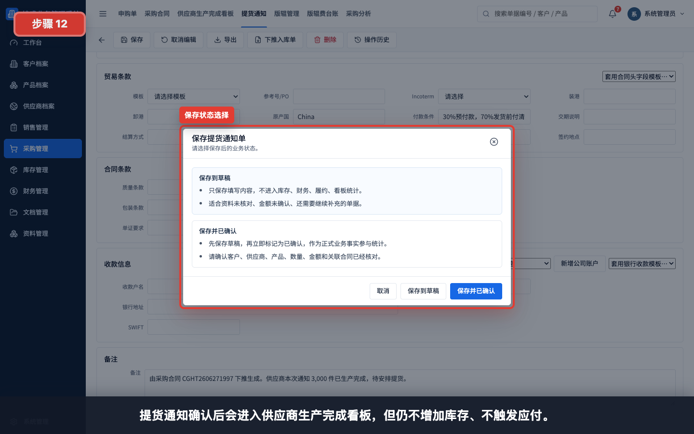

资料未齐时可以先保存到草稿；确认供应商、来源采购合同、产品和本次 ready 数量无误后，选择“保存并已确认”。

状态说明：

| 状态 | 适用情况 | 后续影响 |
|---|---|---|
| 保存到草稿 | ready 数量、提货安排或备注仍需复核 | 不进入生产完成看板 |
| 保存并已确认 | 供应商生产完成 / 待提货事实已确认 | 进入供应商生产完成看板，可下推入库单 |

## 步骤 13：回到提货通知列表验证

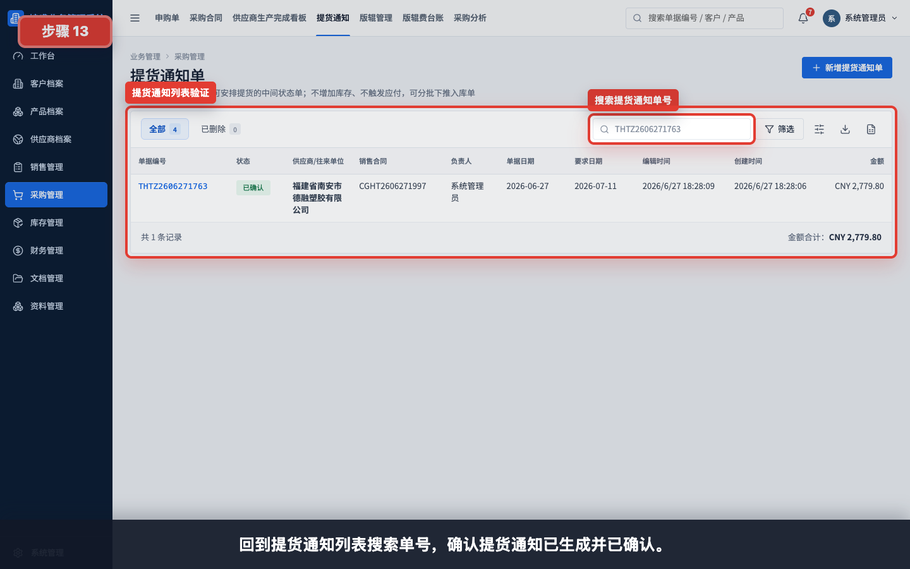

保存后回到“采购管理 > 提货通知”，搜索提货通知单号，确认提货通知已生成并已确认。

## 步骤 14：查看供应商生产完成看板

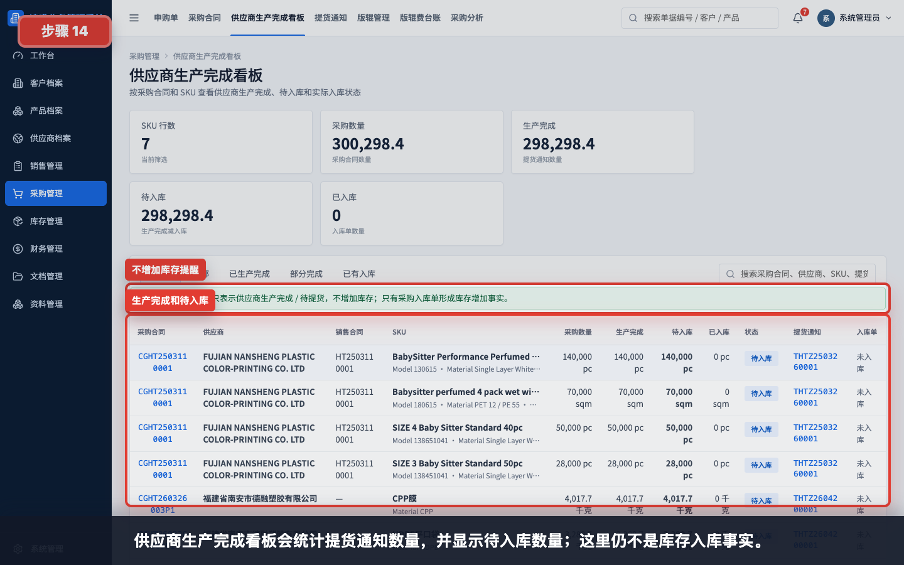

供应商生产完成看板会统计提货通知数量，并显示待入库数量。这里仍不是库存入库事实。

看板理解：

- 生产完成：来自已确认提货通知单。
- 待入库：生产完成数量减已入库数量。
- 已入库：来自采购入库单。

## 步骤 15：查看下推入库单入口

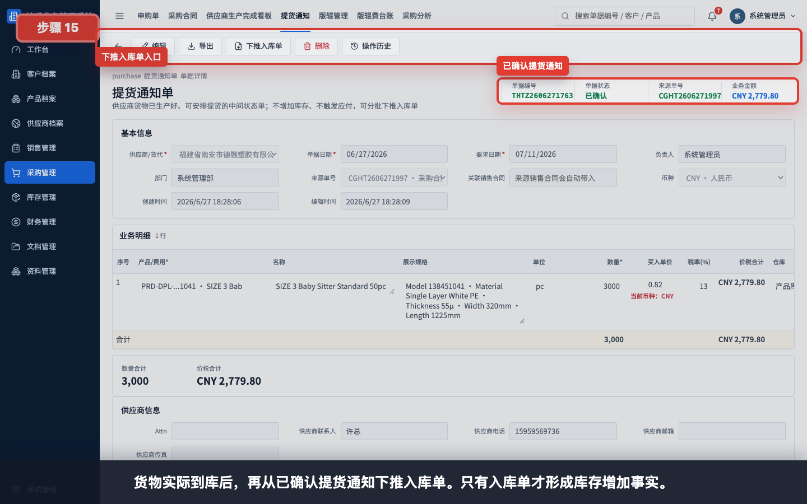

货物实际到库后，再从已确认提货通知下推入库单。只有入库单才形成库存增加事实。

## 常见错误

- 采购合同仍是草稿就尝试下推提货通知。
- 供应商未实际 ready 就提前确认提货通知，导致看板误判生产完成。
- 供应商只完成部分数量，却按采购合同全量登记 ready。
- 把提货通知当作入库单，误以为库存已经增加。
- 提货通知只保存到草稿，导致供应商生产完成看板没有统计。
- 来源采购合同被清空或错误，后续入库、应付和履约追溯断开。
- 货物实际到库后忘记继续下推入库单，导致长期停留在待入库。

## 保存前检查清单

- 采购合同状态为已确认。
- 供应商和来源采购合同正确。
- 本次 ready / 待提货产品、规格、单位和数量已核对。
- 如果是部分 ready，数量已按供应商实际完成数量填写。
- 要求日期 / 预计提货日期已确认。
- 备注已写清供应商通知、分批数量和提货安排。
- 明确本单不增加库存、不触发应付。
- 货物实际到库后，需要继续下推采购入库单。

