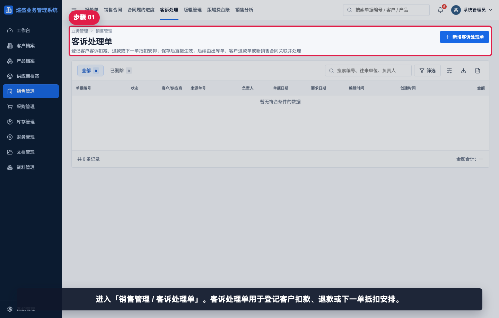
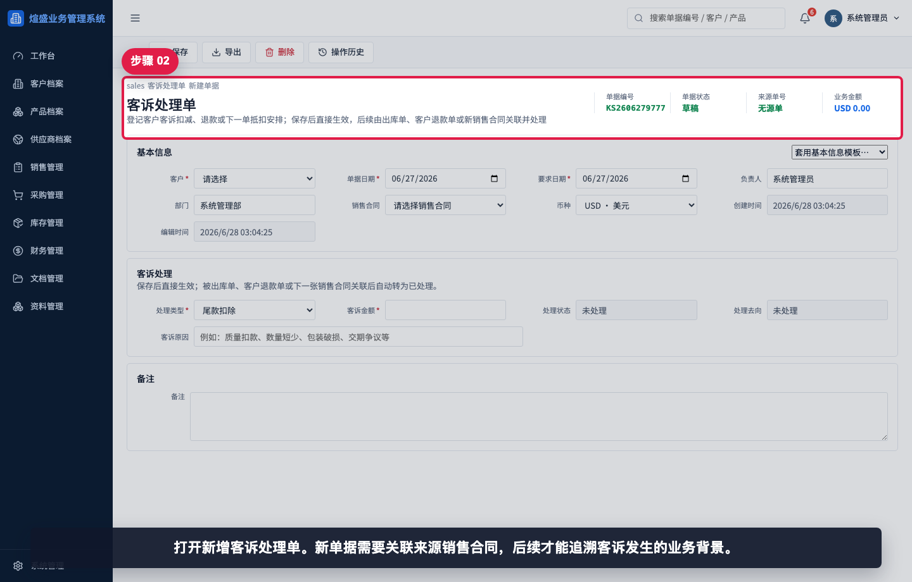
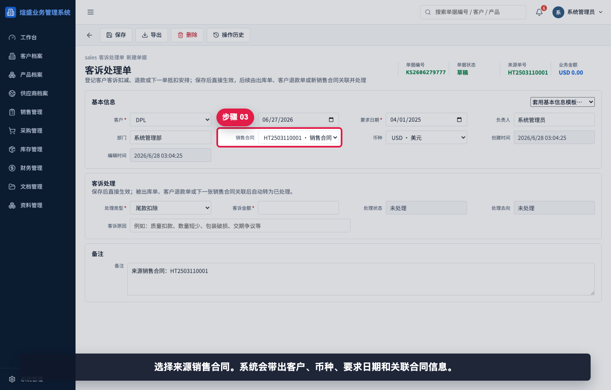
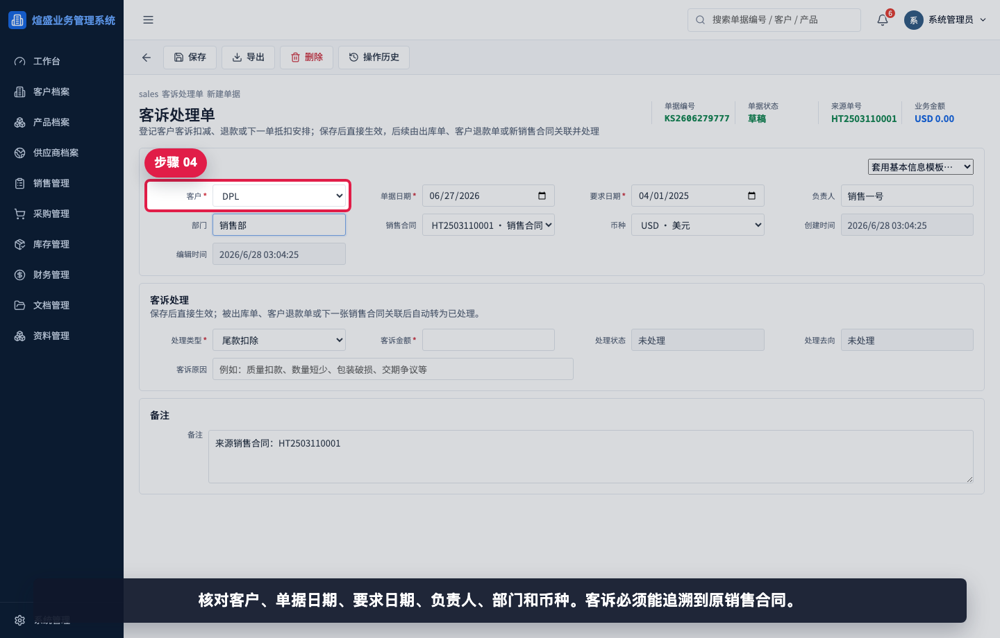
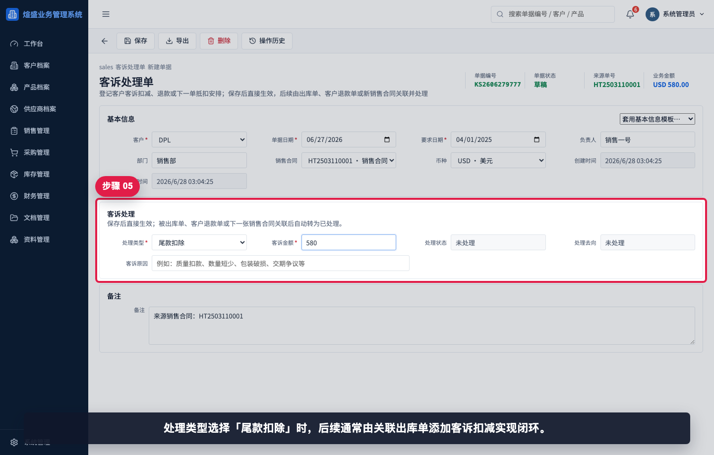
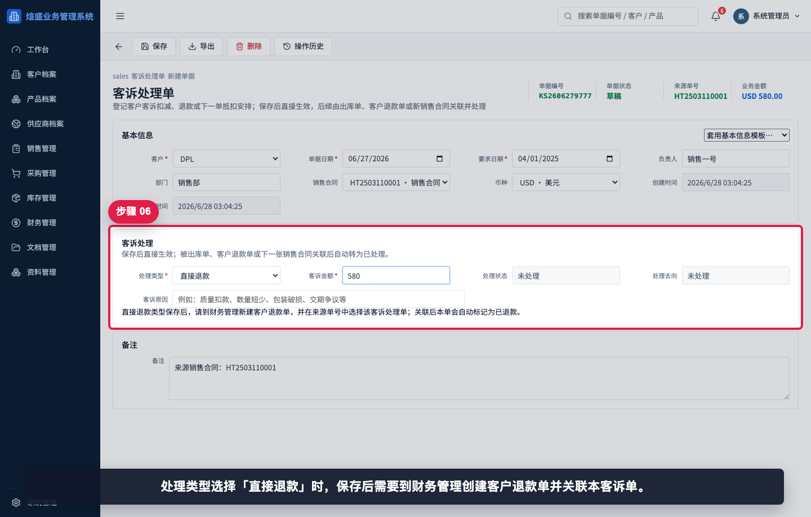
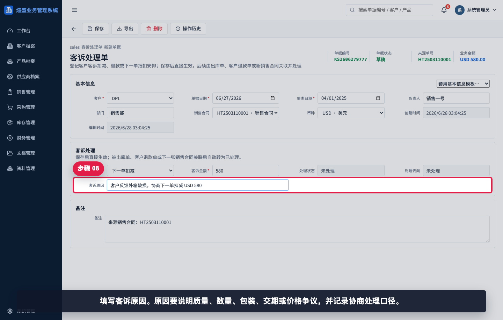
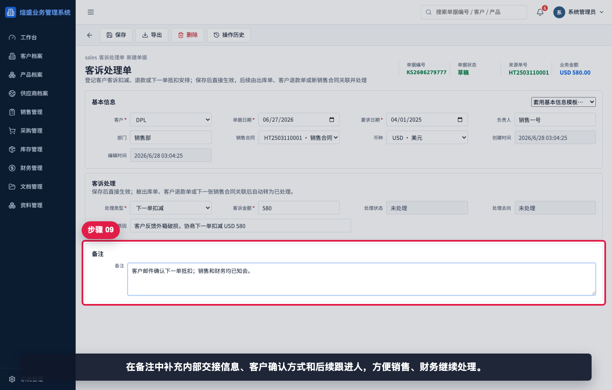
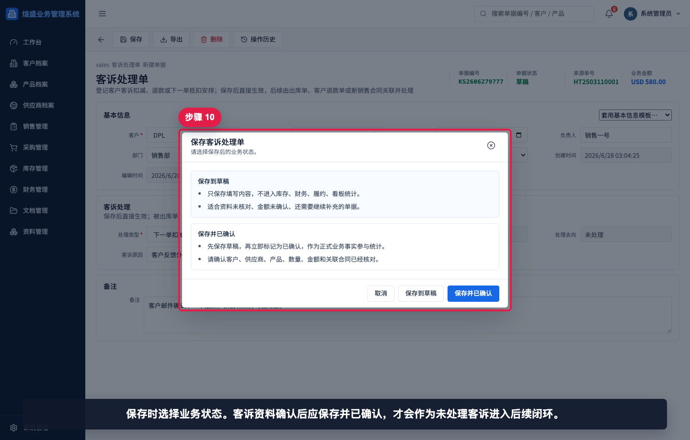
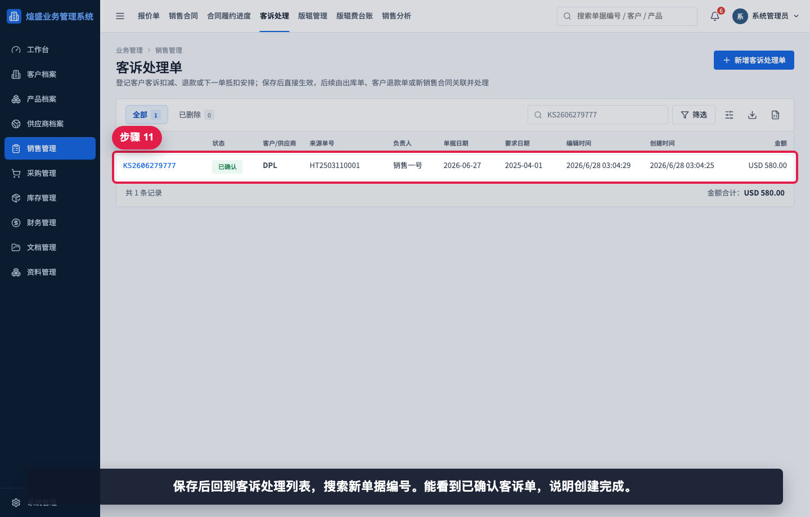

# 如何创建客诉处理单

本指引用于培训销售、财务或管理用户创建客诉处理单。客诉处理单用于登记客户扣款、退款或下一单抵扣安排，必须关联来源销售合同，保存确认后再由出库单、客户退款单或下一张销售合同完成闭环。

## 适用场景

- 客户提出质量扣款、数量短少、包装破损或交期争议。
- 双方协商从尾款中扣除一定金额。
- 需要直接退还客户款项。
- 需要在下一张销售合同中抵扣。
- 需要将客诉原因、金额、处理方式和来源合同留痕。

## 处理类型说明

| 处理类型 | 含义 | 后续闭环方式 |
|---|---|---|
| 尾款扣除 | 从当前销售合同尾款或出库结算中扣减 | 关联出库单后添加客诉扣减 |
| 直接退款 | 我司直接退还客户款项 | 到财务管理创建客户退款单，并选择该客诉单为来源 |
| 下一单扣减 | 在客户下一张销售合同中抵扣 | 新销售合同中添加该客诉扣减 |

## 字段填写说明

| 字段 | 是否必填 | 填写方式 | 影响 |
|---|---|---|---|
| 客户 | 必填 | 选择销售合同后自动带出 | 用于客户追溯和后续扣减匹配 |
| 销售合同 | 必填 | 从已确认客户合同中选择 | 明确客诉来源 |
| 单据日期 | 必填 | 默认当天，可按客诉确认日期调整 | 客诉登记日期 |
| 要求日期 | 必填 | 通常随来源销售合同带出 | 后续跟进参考 |
| 处理类型 | 必填 | 尾款扣除、直接退款、下一单扣减 | 决定后续闭环路径 |
| 客诉金额 | 必填 | 填写正数金额 | 作为扣减或退款金额 |
| 处理状态 | 系统生成 | 默认未处理 | 关联下游单据后自动更新 |
| 处理去向 | 系统生成 | 默认未处理 | 显示下游出库、退款或销售合同 |
| 客诉原因 | 建议填写 | 写清质量、数量、包装、交期或价格争议 | 便于复盘和责任追踪 |
| 备注 | 建议填写 | 写客户确认方式、内部跟进人、证据说明 | 便于销售和财务交接 |

## 步骤 01：进入客诉处理列表

进入“销售管理 / 客诉处理单”。客诉处理单用于登记客户扣款、退款或下一单抵扣安排。

## 步骤 02：打开新增客诉处理单

打开新增客诉处理单。新单据需要关联来源销售合同，后续才能追溯客诉发生的业务背景。

## 步骤 03：选择来源销售合同

选择来源销售合同。系统会带出客户、币种、要求日期和关联合同信息。

## 步骤 04：核对客户和基本信息

核对客户、单据日期、要求日期、负责人、部门和币种。客诉必须能追溯到原销售合同。

## 步骤 05：选择尾款扣除并填写金额

处理类型选择“尾款扣除”时，后续通常由关联出库单添加客诉扣减实现闭环。

## 步骤 06：切换为直接退款

处理类型选择“直接退款”时，保存后需要到财务管理创建客户退款单，并在来源单号中选择该客诉处理单。

## 步骤 07：切换为下一单扣减

处理类型选择“下一单扣减”时，后续由该客户下一张销售合同添加扣减行完成处理。

## 步骤 08：填写客诉原因

填写客诉原因。原因要说明质量、数量、包装、交期或价格争议，并记录协商处理口径。

## 步骤 09：填写内部备注

在备注中补充内部交接信息、客户确认方式和后续跟进人，方便销售、财务继续处理。

## 步骤 10：选择保存状态

保存时选择业务状态。客诉资料确认后应保存并已确认，才会作为未处理客诉进入后续闭环。

## 步骤 11：保存后回到列表验证

保存后回到客诉处理列表，搜索新单据编号。能看到已确认客诉单，说明创建完成。

## 相关教程

- [如何创建销售合同](../创建销售合同/README.md)
- [如何创建库存出库单](../../库存管理/创建库存出库单/README.md)
- [如何创建客户退款单](../../财务管理/创建客户退款单/README.md)
- [如何查看合同履约进度](../../看板报表/查看合同履约进度/README.md)
- [例外业务与专题报表截图指引](../../exceptions-reports/README.md)

## 常见错误

- 未关联来源销售合同，导致无法追溯责任合同和客户。
- 客诉金额填 0 或漏填，保存时会被系统拦截。
- 处理类型选错，导致后续走错闭环路径。
- 直接退款类型保存后，忘记创建客户退款单。
- 下一单扣减类型保存后，忘记在新销售合同中添加扣减。
- 客诉原因写得过于笼统，后续无法复盘责任和证据。

## 保存前检查清单

- 是否选择了正确的来源销售合同。
- 客户、币种、单据日期、负责人和部门是否正确。
- 处理类型是否与客户协商结果一致。
- 客诉金额是否为正数，且币种口径正确。
- 客诉原因是否写清楚争议点和协商结果。
- 备注是否说明证据、客户确认方式和后续跟进人。
