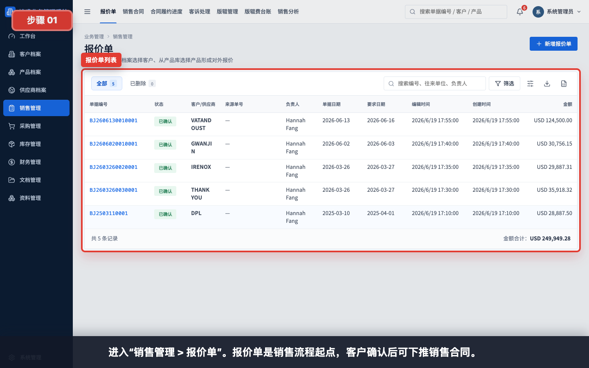
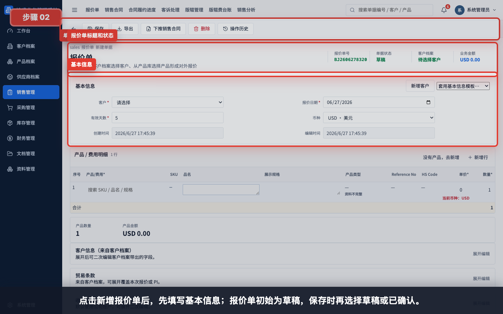
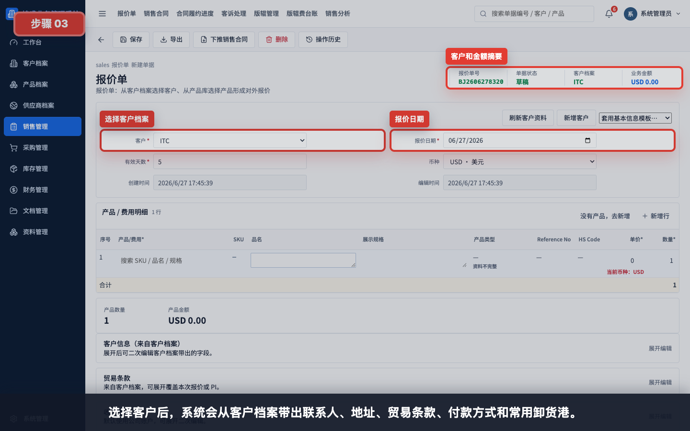
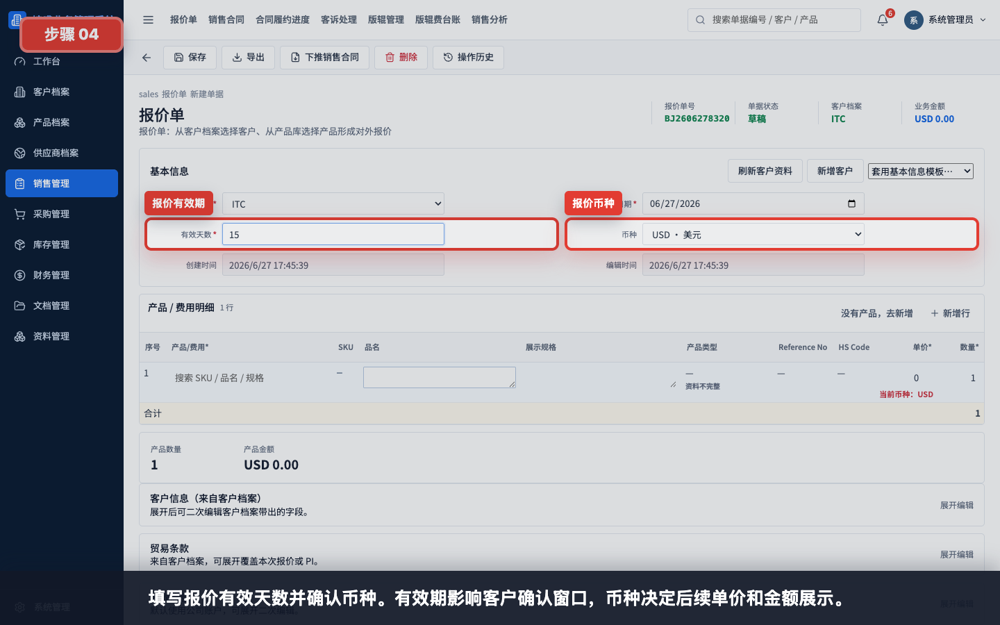
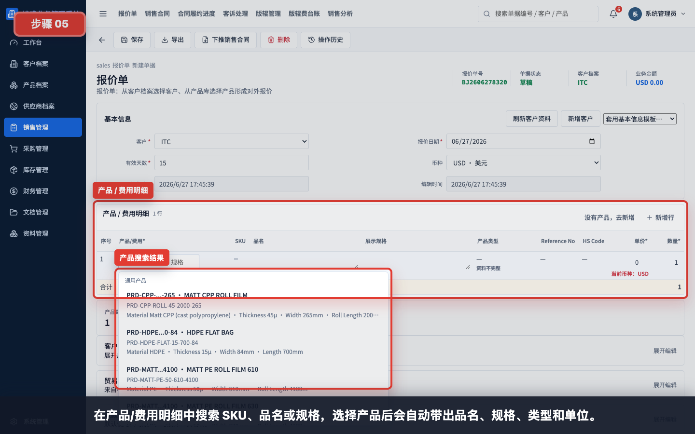
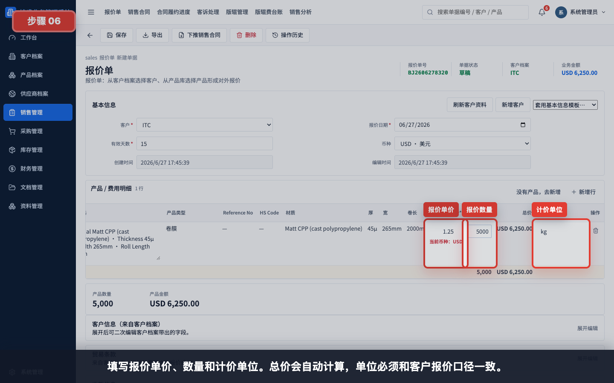
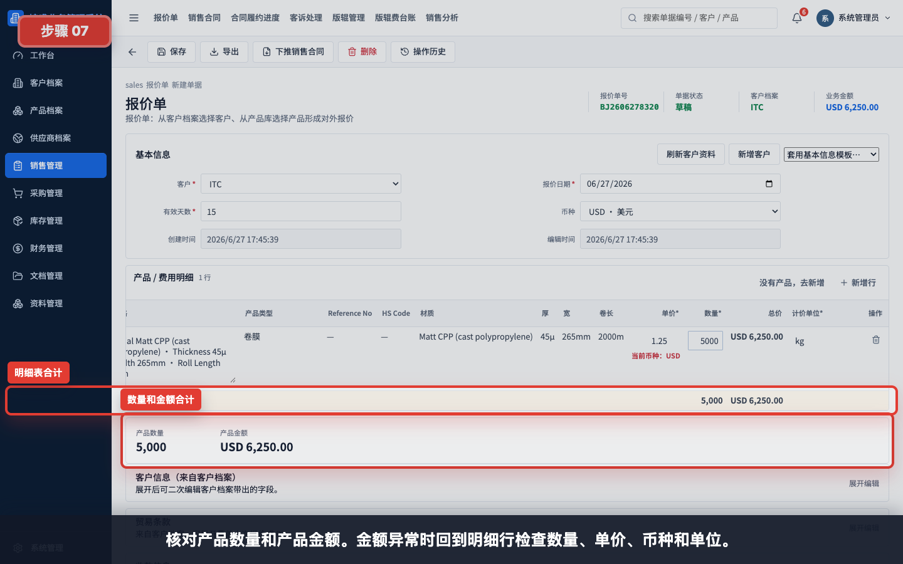
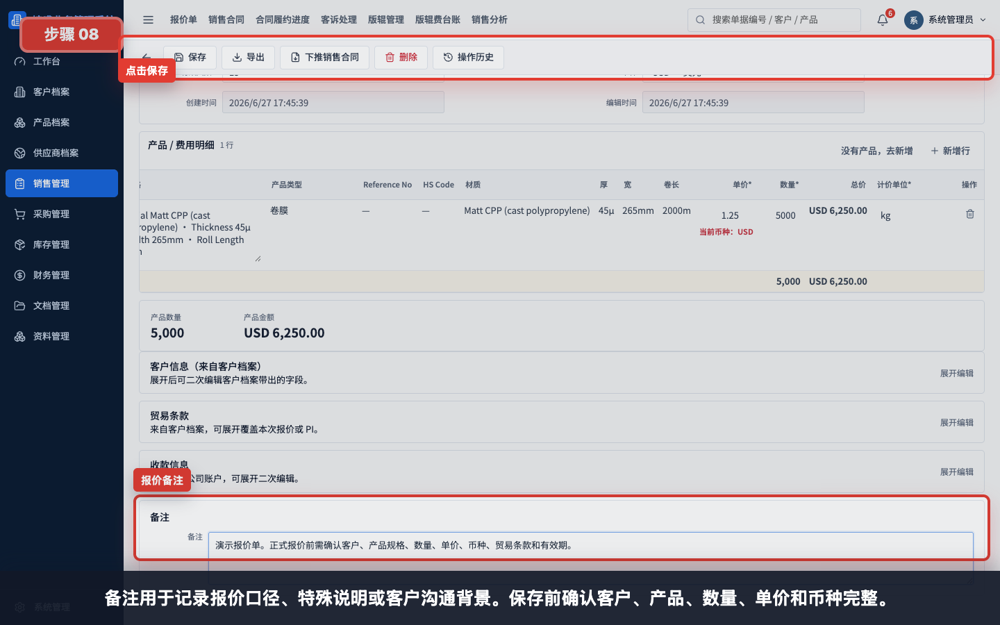
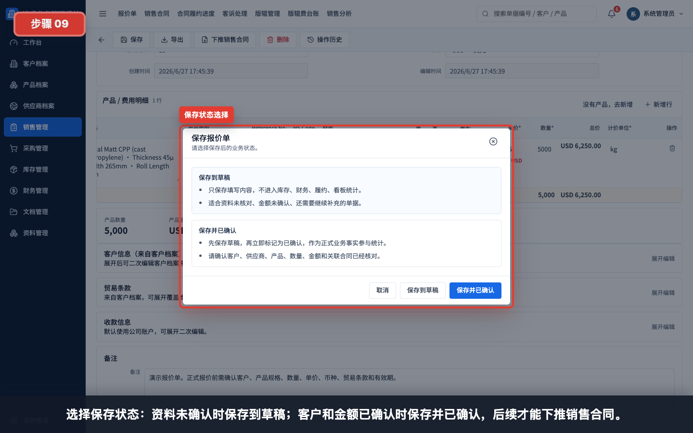
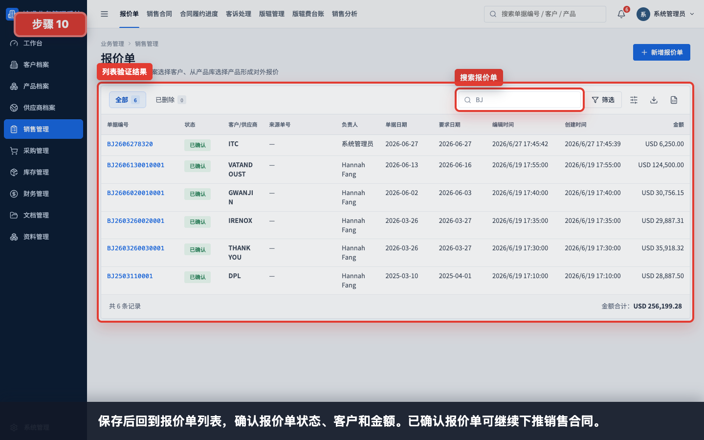

# 如何创建报价单

本指引用于培训新用户从销售管理中创建一张完整报价单。示例覆盖进入报价单列表、打开新增单据、选择客户、填写报价日期、有效天数、币种、选择产品、填写报价单价、数量、计价单位、核对金额、填写备注、保存并验证。

## 适用场景

- 客户询价后需要形成正式报价。
- 需要把客户、产品、规格、数量和单价沉淀为可追溯记录。
- 报价被客户接受后，需要下推销售合同。
- 需要导出 PDF/Excel 给客户确认。

## 前置条件

- 客户档案已建立，且联系人、地址、贸易条款和付款方式尽量完整。
- 产品档案已建立，且产品名称、SKU、规格、单位和产品类型完整。
- 报价币种已在币种汇率中启用。
- 如涉及客户专属产品，产品档案必须绑定该客户。

## 字段填写说明

| 字段 | 是否必填 | 填写方式 | 影响 |
|---|---|---|---|
| 客户 | 必填 | 从客户档案选择 | 带出客户信息、贸易条款、付款方式和卸货港 |
| 报价日期 | 必填 | 默认当天，可按实际报价日期调整 | 报价单号、导出文件和报价有效期参考 |
| 有效天数 | 必填 | 如 15、30 | 对外报价有效期；客户确认窗口参考 |
| 币种 | 建议填写 | 如 USD、CNY | 决定报价单价、总价和导出金额展示 |
| 产品/费用 | 必填 | 搜索 SKU、品名或规格后选择产品 | 带出品名、展示规格、类型、HS Code 和单位 |
| 报价单价 | 必填 | 按客户报价口径填写 | 与数量一起计算产品金额 |
| 数量 | 必填 | 按客户询价数量填写 | 影响合计数量和金额 |
| 计价单位 | 必填 | 如 kg、pc、roll、sqm | 必须与客户沟通口径一致 |
| 备注 | 按需填写 | 写报价口径、限制、特殊说明 | 内部交接和客户沟通追溯 |
| 保存状态 | 必填 | 草稿 / 已确认 | 已确认后才能下推销售合同 |

## 步骤 01：进入报价单列表

进入“销售管理 > 报价单”。报价单是销售流程起点，客户确认后可下推销售合同。

## 步骤 02：打开新增报价单

点击新增报价单后进入单据编辑页。单据初始为草稿，保存时再选择保存到草稿或保存并已确认。

## 步骤 03：选择客户

从客户档案选择客户。系统会带出客户档案中的联系人、地址、贸易条款、付款方式和常用卸货港。客户信息不完整时，应先回客户档案补齐。

## 步骤 04：填写有效期和币种

填写报价有效天数并确认币种。有效期影响客户确认窗口，币种决定后续单价和金额展示。

填写建议：

- 常规报价可使用 15 天或 30 天。
- 原材料价格波动较大时，有效期应缩短。
- 币种应与客户询价和对外报价文件一致。

## 步骤 05：搜索并选择产品

在“产品 / 费用明细”中搜索 SKU、品名或规格，选择产品后会自动带出品名、展示规格、产品类型、Reference No、HS Code 和规格参数。

选择规则：

- 优先选择客户专属产品。
- 没有客户专属产品时，选择通用产品。
- 搜不到产品时，先到产品档案新增或补齐产品资料。

## 步骤 06：填写数量、单价和单位

填写报价单价、数量和计价单位。总价会自动计算，单位必须和客户报价口径一致。

示例：

| 字段 | 示例 |
|---|---|
| 报价单价 | 1.25 |
| 数量 | 5000 |
| 计价单位 | kg |
| 币种 | USD |

## 步骤 07：核对合计金额

核对产品数量和产品金额。金额异常时回到明细行检查数量、单价、币种和单位。

核对重点：

- 产品数量是否等于客户询价数量。
- 报价单价是否包含或不包含客户需要的费用。
- 计价单位是否与单价匹配。
- 币种是否正确。

## 步骤 08：填写备注并保存

备注用于记录报价口径、特殊说明或客户沟通背景。保存前确认客户、产品、数量、单价和币种完整。

保存前检查：

- 客户是否正确。
- 产品是否选自产品档案。
- 数量、单价、单位、币种是否一致。
- 有效天数是否符合报价策略。
- 备注是否写清特殊条件。

## 步骤 09：选择保存状态

选择保存状态。资料未确认时保存到草稿；客户和金额已确认时保存并已确认。只有已确认报价单才能下推销售合同。

保存状态说明：

| 状态 | 适用情况 | 后续影响 |
|---|---|---|
| 保存到草稿 | 资料未核对、金额未确认、还需补充 | 不进入正式统计，不建议下推 |
| 保存并已确认 | 客户、产品、数量、金额已核对 | 可参与统计，并可下推销售合同 |

## 步骤 10：保存后回到列表验证

保存后回到报价单列表，确认报价单状态、客户和金额。已确认报价单可继续下推销售合同。

## 常见错误

- 未先维护客户档案，导致客户信息、贸易条款或付款方式为空。
- 选择了通用产品，但实际应使用客户专属 SKU。
- 单价和单位口径不一致，例如单价按 kg，单位却填 pc。
- 报价币种选错，导致导出金额口径错误。
- 产品只手工改名称，没有从产品档案选择，后续合同和采购无法稳定追溯。
- 未保存为已确认，导致无法下推销售合同。
