# 如何创建销售合同

本指引用于培训新用户手工创建一张销售合同。示例覆盖进入销售合同列表、打开新增销售合同、选择客户、填写基本信息、选择产品、填写合同数量和销售单价、核对金额、核对客户信息、维护贸易条款、查看合同附件区域、填写备注、保存并验证。

## 适用场景

- 客户直接下单，不需要先走报价单。
- 历史合同或线下合同需要补录到系统。
- 需要手工录入销售合同，并作为后续申购、采购、出库、收款和归档的源单。
- 报价单来源缺失，但客户、产品、数量、价格和条款已经确认。

优先建议：如果系统中已有报价单，尽量使用“报价单下推销售合同”，保留报价和合同之间的来源追溯。

## 前置条件

- 客户档案已建立，联系人、合同名、地址、贸易条款和付款方式尽量完整。
- 产品档案已建立，SKU、品名、展示规格、单位和产品类型完整。
- 合同数量、销售单价、币种、交付要求和客户 PO / Ref. No. 已确认。
- 盖章合同、客户 PO、邮件确认或补充协议等附件资料已准备好，或计划后续补充。

## 字段填写说明

| 字段 | 是否必填 | 填写方式 | 影响 |
|---|---|---|---|
| 客户 | 必填 | 从客户档案选择 | 带出客户信息、贸易条款、收款信息，后续应收和归档按客户追溯 |
| 单据日期 | 必填 | 默认当天，可按合同日期调整 | 合同记录和统计日期 |
| 要求日期 | 必填 | 填客户要求交付或合同要求日期 | 采购、入库、出库和履约跟进参考 |
| Ref. No. | 按需填写 | 填客户 PO、客户合同号或参考号 | 导出和客户对账时识别 |
| 币种 | 建议填写 | 如 USD、CNY | 决定合同单价和金额展示 |
| 产品 / 费用 | 必填 | 从产品档案搜索选择 | 后续申购、采购、库存和履约追溯依赖产品行 |
| 销售单价 | 建议填写 | 按合同口径填写 | 计算合同金额和后续销售分析 |
| 合同数量 | 必填 | 按客户下单数量填写 | 影响申购需求、库存占用和出库数量 |
| 计价单位 | 必填 | 如 kg、pc、roll、sqm | 必须与销售单价口径一致 |
| 客户信息 | 建议核对 | 展开后核对合同名、联系人、地址、电话 | 导出合同和业务沟通使用 |
| 贸易条款 | 建议核对 | 展开后确认 INCOTERM、付款方式、装港、卸港 | 合同执行和收款跟进使用 |
| 合同附件 | 按需上传 | 上传盖章件、客户 PO、补充协议等 | 文档归档和审计追溯 |
| 备注 | 按需填写 | 写合同背景、客户确认方式或特殊要求 | 内部交接和异常追溯 |
| 保存状态 | 必填 | 草稿 / 已确认 | 已确认后才能进入后续申购、采购、库存和财务流程 |

## 步骤 01：进入销售合同列表

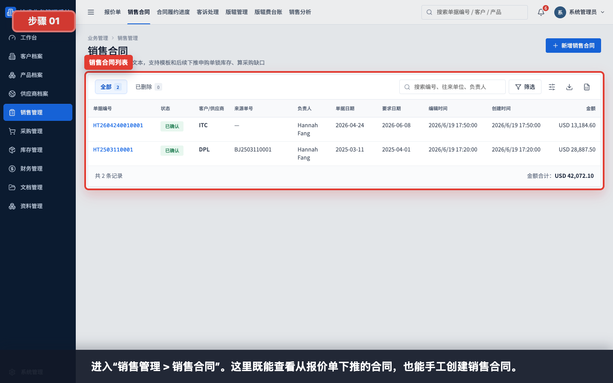

进入“销售管理 > 销售合同”。这里既能查看从报价单下推的合同，也能手工创建销售合同。

## 步骤 02：打开新增销售合同

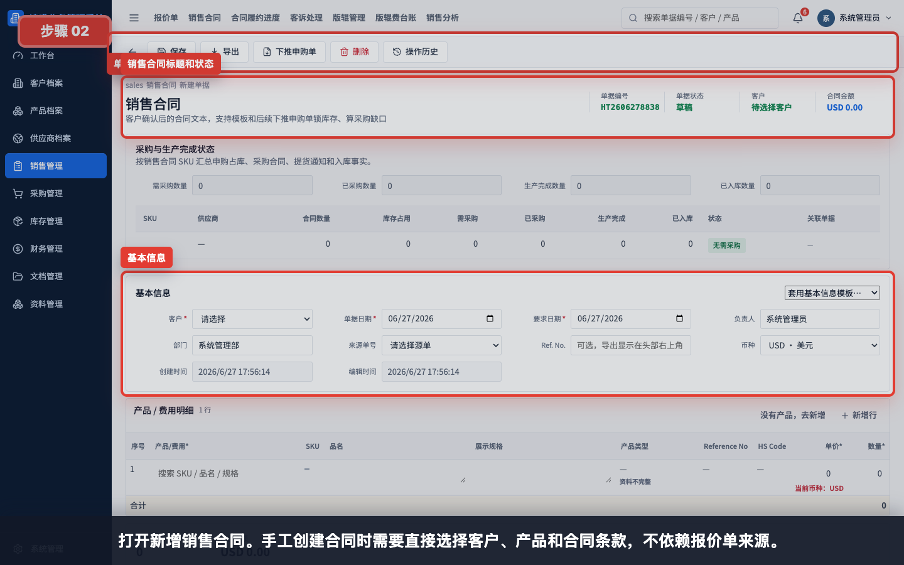

打开新增销售合同。手工创建合同时，需要直接选择客户、产品和合同条款，不依赖报价单来源。

## 步骤 03：选择客户和基本信息

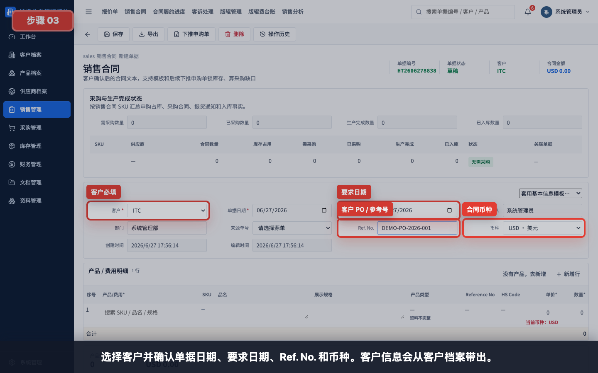

选择客户并确认单据日期、要求日期、Ref. No. 和币种。客户信息会从客户档案带出。

填写建议：

- 客户必须从客户档案选择，不建议手工输入临时名称。
- Ref. No. 可填写客户 PO、客户合同号或邮件确认编号。
- 要求日期应与客户交付要求一致。
- 币种应与合同报价和收款币种一致。

## 步骤 04：搜索并选择合同产品

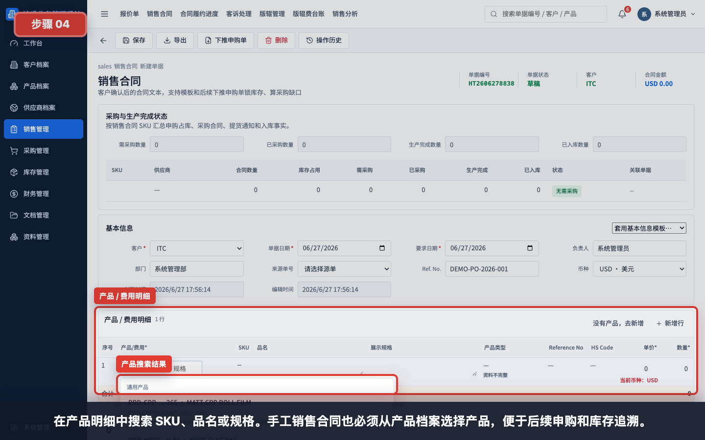

在产品明细中搜索 SKU、品名或规格。手工销售合同也必须从产品档案选择产品，便于后续申购和库存追溯。

选择规则：

- 客户专属产品优先选择客户专属 SKU。
- 通用产品可用于多个客户。
- 搜不到产品时，先到产品档案新增或补齐产品资料。

## 步骤 05：填写合同数量、单价和单位

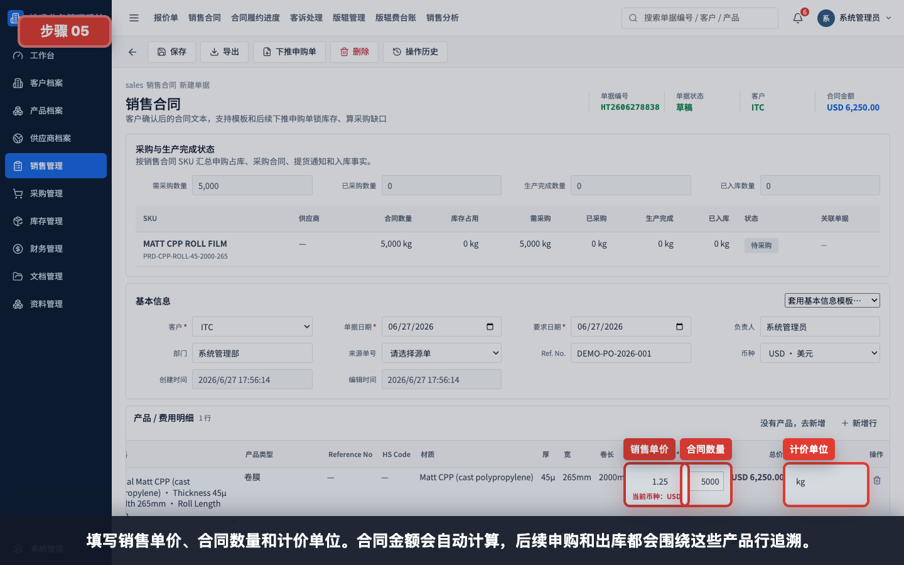

填写销售单价、合同数量和计价单位。合同金额会自动计算，后续申购和出库都会围绕这些产品行追溯。

示例：

| 字段 | 示例 |
|---|---|
| 销售单价 | 1.25 |
| 合同数量 | 5000 |
| 计价单位 | kg |
| 币种 | USD |

## 步骤 06：核对合同金额

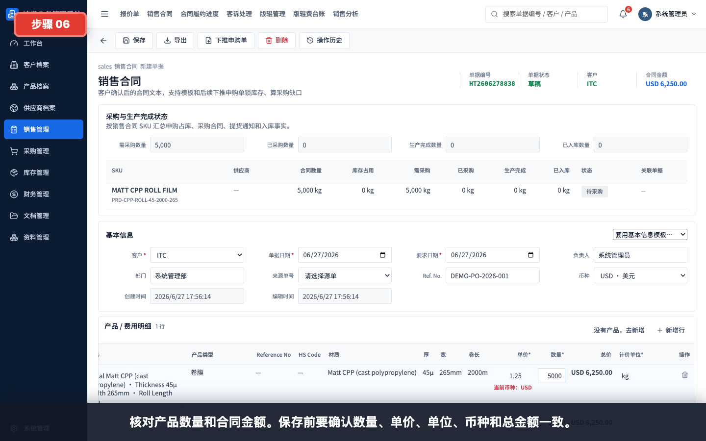

核对产品数量和合同金额。保存前要确认数量、单价、单位、币种和总金额一致。

核对重点：

- 数量是否等于客户下单数量。
- 单价是否与客户确认一致。
- 单位是否与单价口径一致。
- 合同金额是否符合客户 PO 或线下合同。

## 步骤 07：核对客户信息

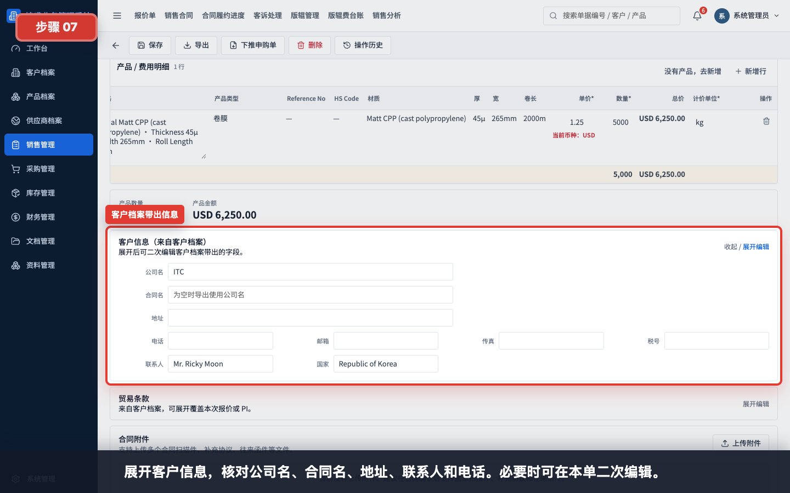

展开客户信息，核对公司名、合同名、地址、联系人和电话。必要时可在本单二次编辑；如果是长期错误，应回客户档案修正。

## 步骤 08：维护贸易条款

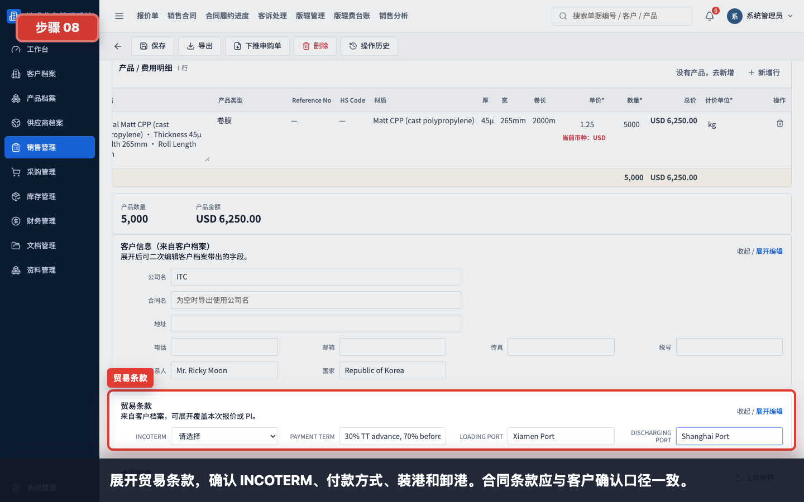

展开贸易条款，确认 INCOTERM、付款方式、装港和卸港。合同条款应与客户确认口径一致。

常见填写：

| 字段 | 示例 |
|---|---|
| INCOTERM | FOB / CIF / EXW |
| PAYMENT TERM | 30% TT advance, 70% before shipment |
| LOADING PORT | Xiamen Port |
| DISCHARGING PORT | Shanghai Port |

## 步骤 09：查看合同附件区域

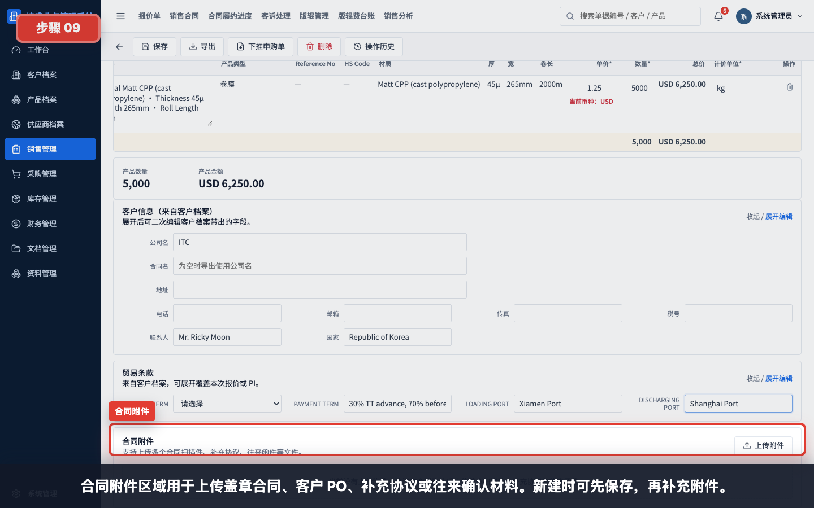

合同附件区域用于上传盖章合同、客户 PO、补充协议或往来确认材料。新建时可先保存，再补充附件。

建议上传：

- 客户 PO。
- 盖章销售合同。
- 邮件确认截图或 PDF。
- 补充协议、变更通知或特殊要求说明。

## 步骤 10：填写备注并保存

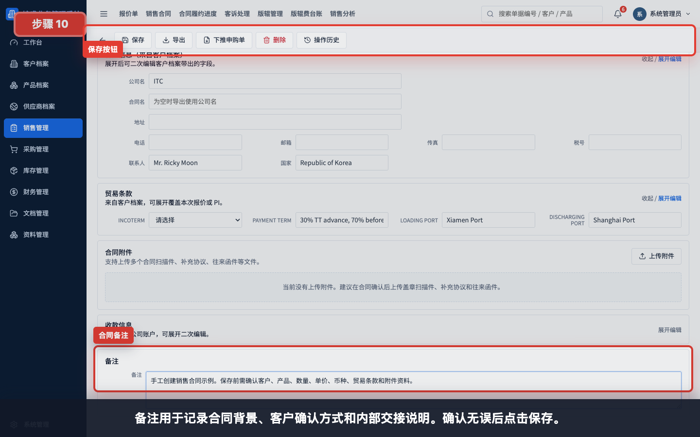

备注用于记录合同背景、客户确认方式和内部交接说明。确认无误后点击保存。

保存前检查：

- 客户和合同主体是否正确。
- 产品、数量、单价、单位和币种是否正确。
- 贸易条款和付款方式是否确认。
- 客户 PO / Ref. No. 是否填写。
- 附件是否已上传或已安排后续补充。
- 备注是否写清特殊交付、包装、付款或沟通要求。

## 步骤 11：选择保存状态

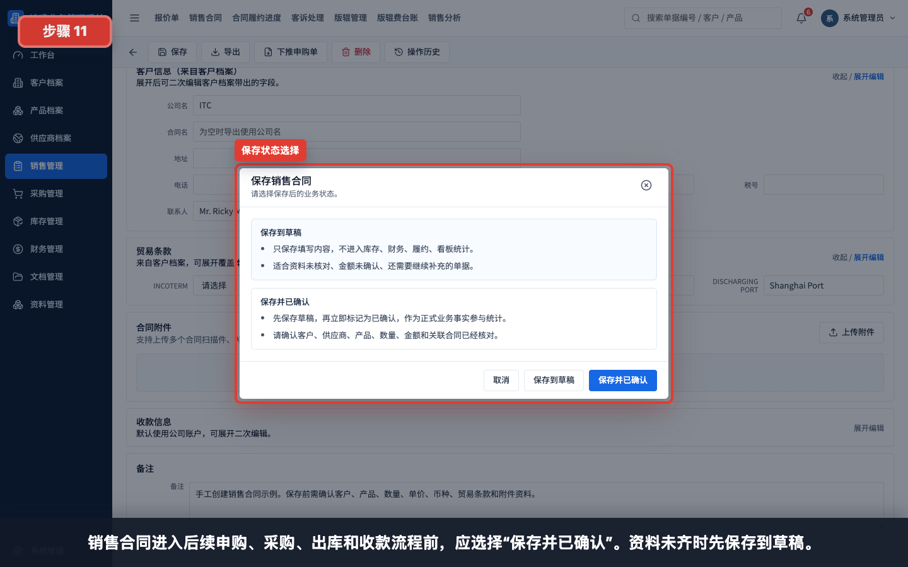

销售合同进入后续申购、采购、出库和收款流程前，应选择“保存并已确认”。资料未齐时先保存到草稿。

状态说明：

| 状态 | 适用情况 | 后续影响 |
|---|---|---|
| 保存到草稿 | 资料未核对、金额未确认、附件未补齐 | 不进入正式履约，不建议下推 |
| 保存并已确认 | 客户、产品、数量、金额和条款已确认 | 可下推申购单，并进入采购、库存、财务和文档归档 |

## 步骤 12：保存后回到列表验证

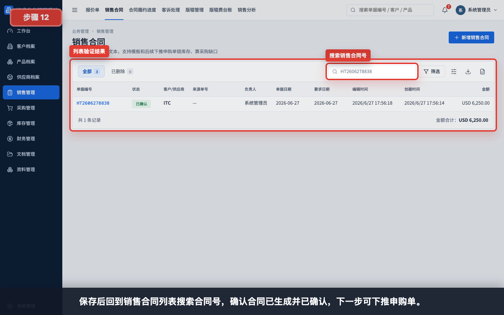

保存后回到销售合同列表，搜索合同号，确认合同已生成并已确认。下一步通常是下推申购单。

## 常见错误

- 已有报价单却手工创建销售合同，导致报价和合同缺少来源追溯。
- 客户档案不完整，合同名、地址、联系人或贸易条款带出为空。
- 产品没有从产品档案选择，后续申购和库存无法稳定追溯。
- 单价和计价单位不一致，例如单价按 kg，单位却填 pc。
- 合同保存到草稿后忘记确认，导致无法进入后续申购流程。
- 附件未上传，后续归档、审计或客户争议时缺少依据。
