# 如何从报价单下推销售合同

本指引用于培训新用户把一张已确认报价单下推为销售合同。示例覆盖查找已确认报价单、打开报价单详情、确认下推入口、阅读下推提醒、生成销售合同草稿、核对继承明细、补充合同备注、保存并确认、回到销售合同列表验证和查看后续动作。

## 适用场景

- 客户已经接受报价，需要进入正式销售合同阶段。
- 希望从报价单继承客户、贸易条款、产品明细、报价单价和金额，避免重复录入。
- 需要保留“报价单 -> 销售合同”的来源追溯。
- 后续需要从销售合同继续下推申购单、采购、出库、收款和文档归档。

## 前置条件

- 报价单已经保存并已确认。
- 报价单中的客户、产品规格、数量、单价、币种、贸易条款和有效期已被客户接受。
- 报价单明细来自产品档案，产品编码、单位和规格口径完整。
- 如果需要对合同做补充说明，先准备好客户确认内容或内部备注。

## 下推后字段继承说明

| 字段 / 信息 | 来源 | 下推后影响 |
|---|---|---|
| 客户 | 报价单客户 | 生成销售合同客户，后续申购、出库、收款都以此客户追溯 |
| 来源单号 | 报价单号 | 销售合同基本信息中保留来源关系 |
| 产品明细 | 报价单产品行 | 继承 SKU、品名、展示规格、数量、单位和报价单价 |
| 合同金额 | 报价单明细金额 | 作为销售合同金额，后续履约和财务看板参考 |
| 贸易条款 | 报价单 / 客户档案 | 生成合同默认条款，可在合同中二次调整 |
| 收款信息 | 报价单 / 公司账户 | 导出和合同收款信息参考 |
| 备注 | 下推后可补充 | 记录客户确认、变更说明或内部交接信息 |
| 合同状态 | 下推生成后为草稿 | 核对后需要保存并已确认，才能进入后续流程 |

## 步骤 01：找到已确认报价单

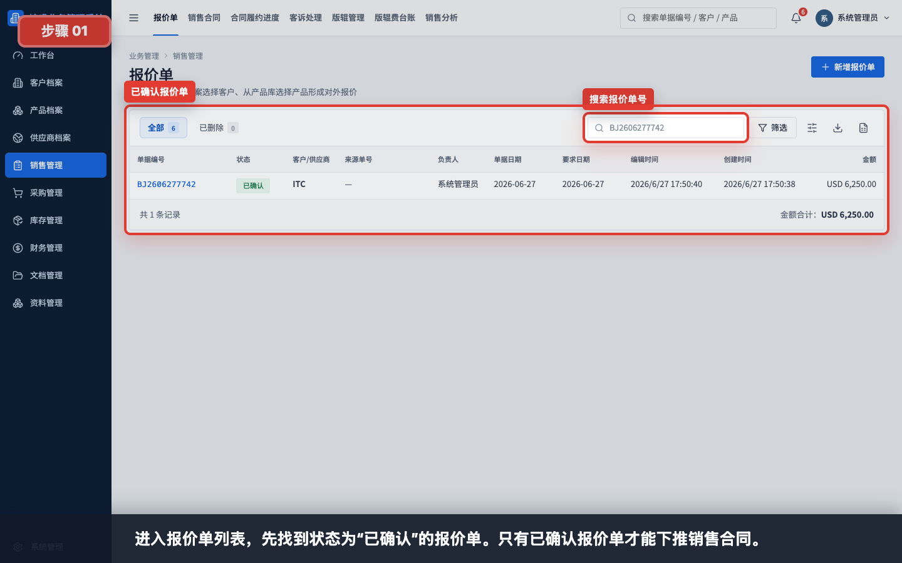

进入“销售管理 > 报价单”，搜索报价单号或客户，找到状态为“已确认”的报价单。草稿报价单不能下推销售合同。

## 步骤 02：打开报价单详情

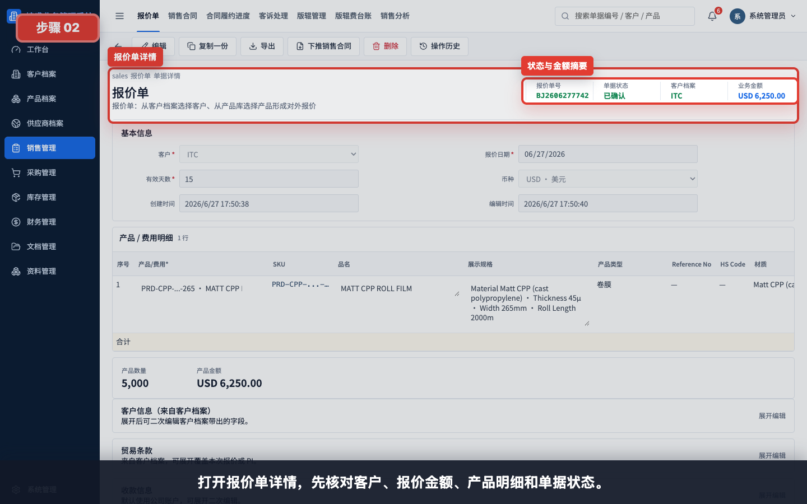

打开报价单详情，先核对客户、报价金额、产品明细和单据状态。下推前应确认该报价已被客户接受。

## 步骤 03：确认下推入口

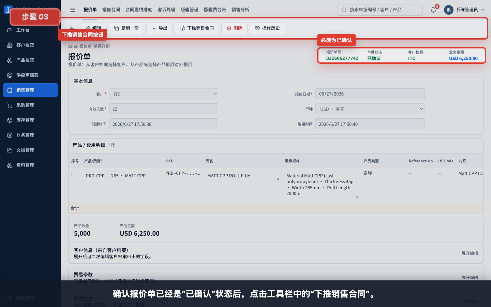

确认报价单状态为“已确认”后，点击工具栏中的“下推销售合同”。如果看不到下推入口，通常是报价单仍为草稿或当前账号没有操作权限。

## 步骤 04：查看下推前确认

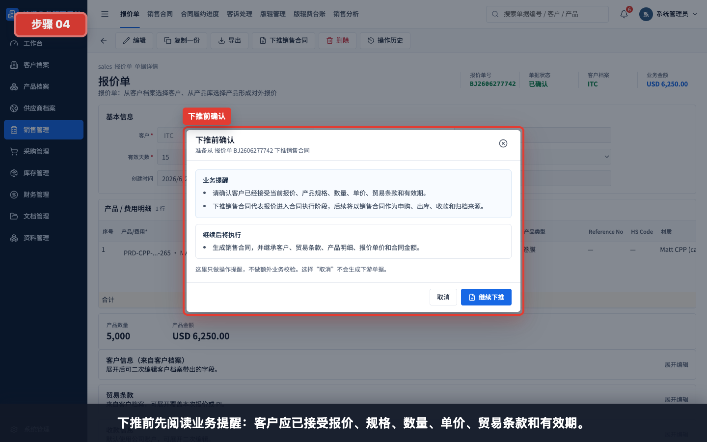

系统会弹出“下推前确认”。这里提醒用户确认客户已经接受当前报价、产品规格、数量、单价、贸易条款和有效期。

## 步骤 05：确认生成销售合同影响

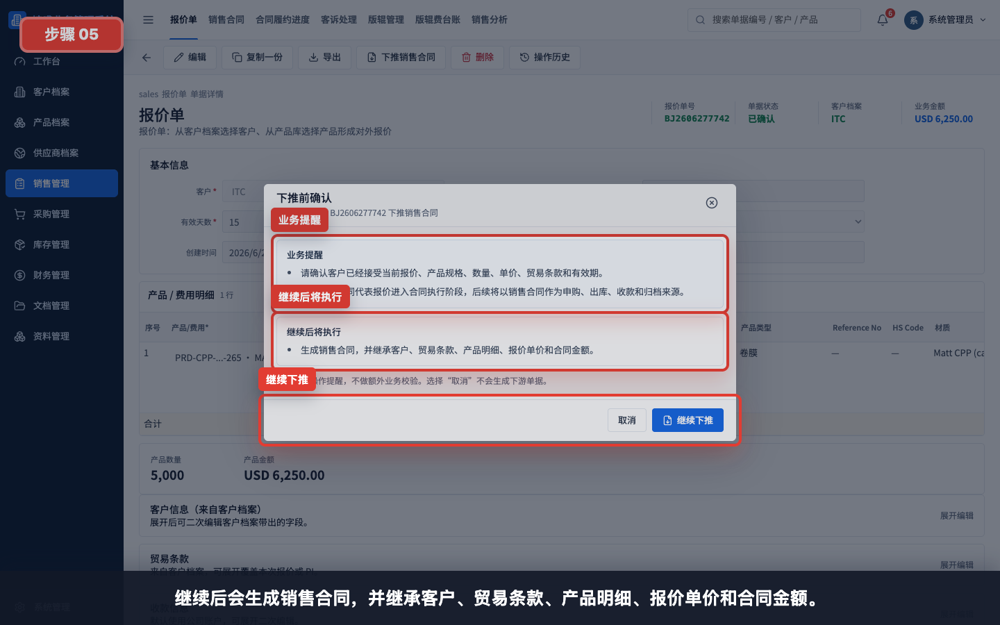

继续下推后，系统会生成销售合同，并继承客户、贸易条款、产品明细、报价单价和合同金额。选择“取消”不会生成下游单据。

## 步骤 06：生成销售合同草稿

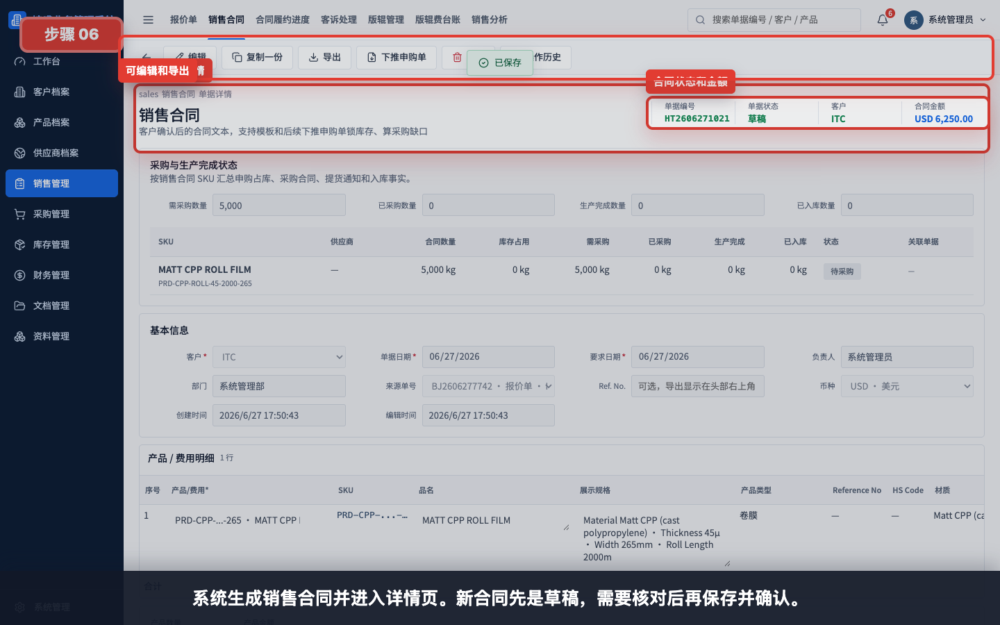

点击“继续下推”后，系统生成销售合同并进入详情页。新生成的销售合同先是草稿，需要核对后再保存并确认。

## 步骤 07：核对继承的产品明细

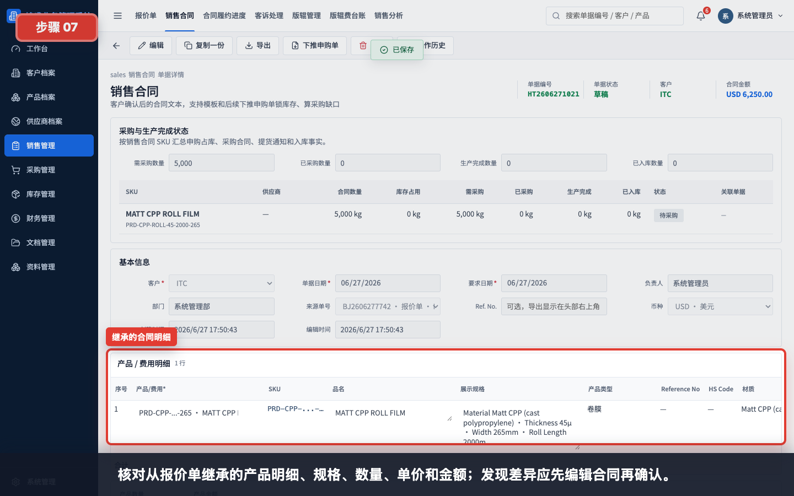

核对从报价单继承的产品明细、规格、数量、单价和金额。发现差异时，应先编辑销售合同，再保存并确认。

核对重点：

- SKU、品名和展示规格是否与客户确认一致。
- 数量和计价单位是否正确。
- 单价和币种是否与报价单一致。
- 合同金额是否等于客户接受的报价金额。

## 步骤 08：编辑合同备注并保存

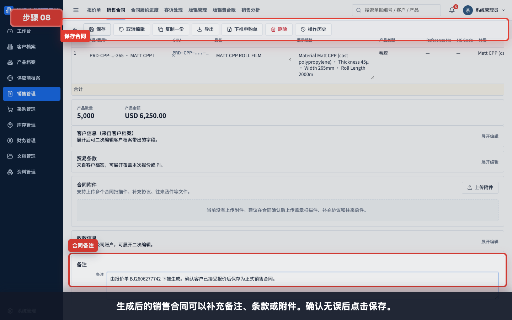

生成后的销售合同可以补充备注、条款或附件。备注建议写明来源报价单、客户确认方式、特殊交付要求或内部交接说明。

保存前检查：

- 客户和合同主体是否正确。
- 来源报价单号是否保留。
- 产品明细是否完整。
- 合同金额、币种和付款条款是否正确。
- 需要上传附件时，是否已准备盖章件、邮件确认或客户 PO。

## 步骤 09：保存并确认销售合同

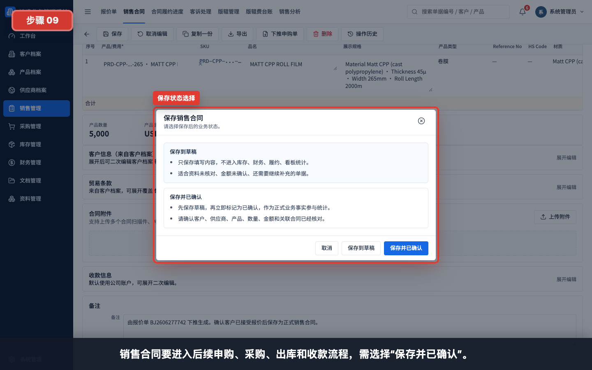

销售合同要进入后续申购、采购、出库和收款流程，需选择“保存并已确认”。如果合同仍需客户或主管确认，可以先保存到草稿。

状态说明：

| 状态 | 适用情况 | 后续影响 |
|---|---|---|
| 保存到草稿 | 合同资料未核对、金额未确认、附件未补齐 | 不建议进入下游流程 |
| 保存并已确认 | 客户、产品、数量、金额和条款已确认 | 可作为正式源单进入申购、采购、库存、财务和归档流程 |

## 步骤 10：回到销售合同列表验证

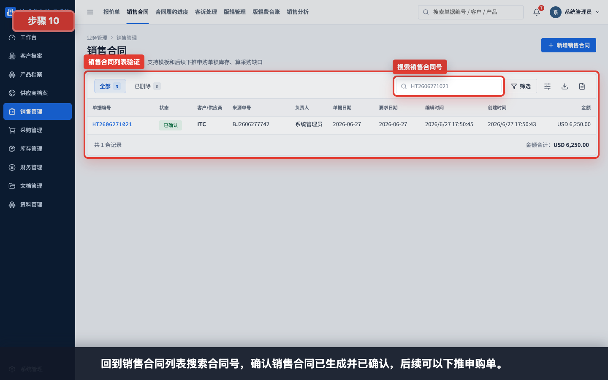

回到销售合同列表，搜索合同号，确认销售合同已生成并已确认。列表中应能看到客户、状态和合同金额。

## 步骤 11：查看合同后续动作

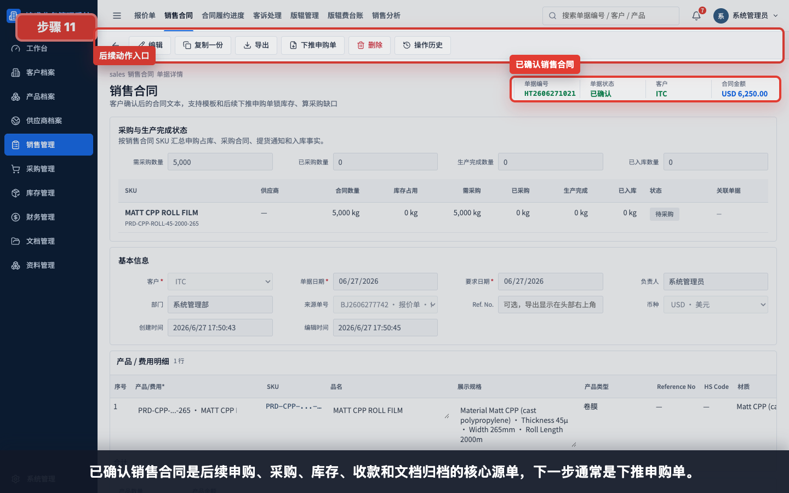

已确认销售合同是后续申购、采购、库存、收款和文档归档的核心源单。下一步通常是下推申购单，系统会按销售合同 SKU 计算库存占用和采购缺口。

## 常见错误

- 报价单仍是草稿就尝试下推，系统会提示先保存并已确认。
- 客户尚未正式接受报价就下推销售合同，导致合同阶段过早。
- 下推后未核对产品明细，报价中的错误被带入销售合同。
- 生成销售合同后没有保存并已确认，后续申购、采购和履约无法正常推进。
- 误以为下推后会自动完成所有合同资料。实际仍需要核对合同备注、条款、附件和客户确认资料。
- 手工重建销售合同而不是从报价单下推，导致报价和合同之间缺少来源追溯。
