# 如何从销售合同下推申购单

本指引用于培训新用户把已确认销售合同下推为申购单。示例覆盖查找已确认销售合同、打开合同详情、阅读下推确认、生成申购单草稿、核对库存占用和采购缺口、保存并确认申购单，以及验证后续可下推采购合同。

## 适用场景

- 销售合同已经生效，需要进入采购准备。
- 客户合同数量已经确认，需要先判断现有库存是否可以承接。
- 同一张销售合同要形成申购单，作为采购合同、提货通知和入库的来源。
- 需要让采购只采购真实缺口，而不是重复采购全部销售数量。

## 前置条件

- 销售合同已保存并已确认。
- 合同产品、数量、单位和交付要求已经核对。
- 产品档案已建立，SKU、品名、单位和产品类型完整。
- 需要进入采购准备的业务已经得到内部确认。

## 字段和计算口径

| 字段 | 含义 | 填写或检查方式 | 影响 |
|---|---|---|---|
| 销售合同 | 申购单来源单据 | 由下推自动带出 | 后续采购、入库和履约都按此追溯 |
| 需求总数 | 销售合同产品需求数量 | 系统从销售合同产品行带出 | 代表客户实际需求 |
| 已有库存 | 当前账面库存 | 系统只读展示 | 用于理解现有库存规模 |
| 可申购库存 | 当前可被本申购单占用的库存 | 系统按可用库存计算，必要时人工复核 | 会减少后续需采购数量 |
| 需采购数量 | 本次还需要采购的数量 | 系统计算：需求总数 - 可申购库存 | 后续采购合同承接此数量 |
| 备注 | 申购说明 | 记录来源、库存判断和采购安排 | 便于采购、仓库和管理层交接 |
| 保存状态 | 草稿 / 已确认 | 资料未齐先草稿，确认无误后保存并已确认 | 已确认后才正式占用可申购库存，并可继续下推采购合同 |

核心公式：

```text
需采购数量 = 需求总数 - 可申购库存
```

注意：已有库存只是只读参考；真正用于本张申购单的是“可申购库存”。如果已有库存已经被其他业务占用，可申购库存可能小于已有库存。

## 步骤 01：找到已确认销售合同

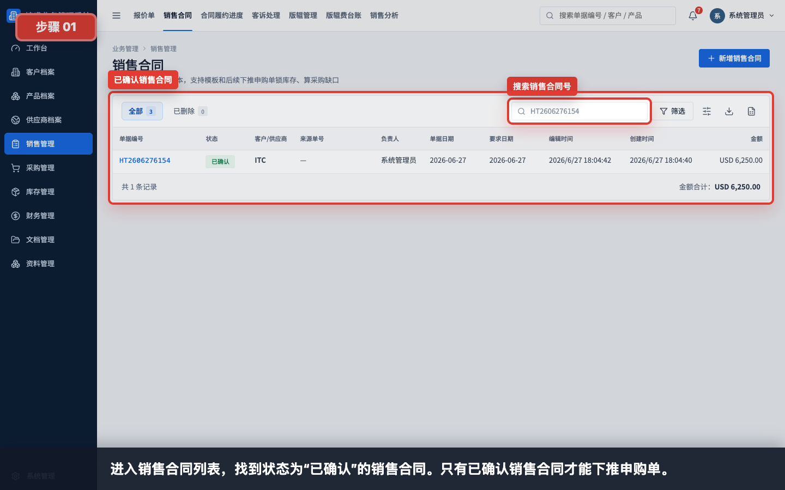

进入“销售管理 > 销售合同”，搜索需要履约的销售合同号。只有已确认的销售合同才适合下推申购单。

检查重点：

- 单据状态是否为已确认。
- 客户、合同金额和产品数量是否与客户下单一致。
- 是否已经存在来源相同的申购单，避免重复下推。

## 步骤 02：打开销售合同详情

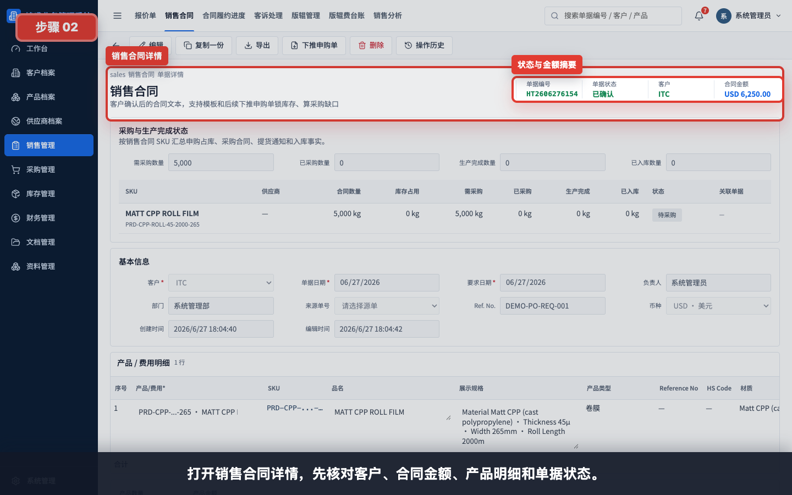

打开销售合同详情，先核对客户、合同金额、产品明细和单据状态。确认无误后再进入下推动作。

## 步骤 03：确认下推申购单入口

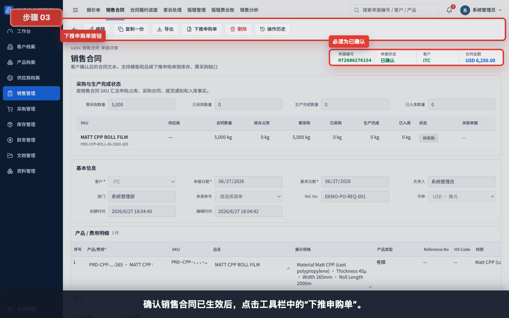

在已确认销售合同的工具栏点击“下推申购单”。这个动作代表销售合同正式进入采购准备阶段。

## 步骤 04：查看下推前确认

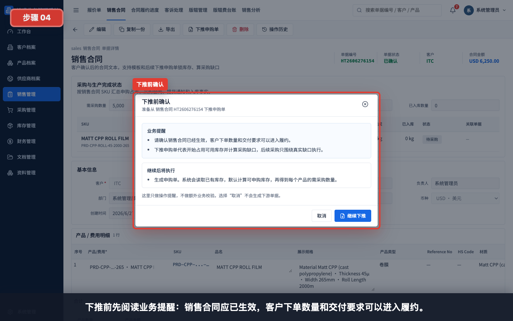

系统会弹出下推前确认。这里要确认销售合同已经生效，客户下单数量和交付要求可以进入履约。

## 步骤 05：确认库存占用和采购缺口影响

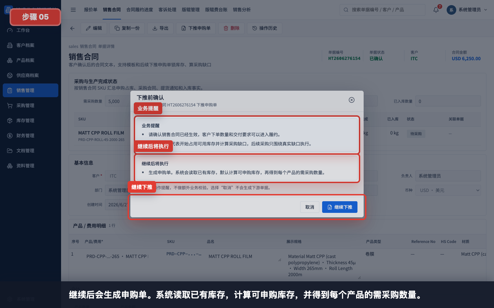

继续下推后，系统会读取已有库存，计算可申购库存，再得到每个产品的需采购数量。

业务含义：

- 有可用库存时，优先占用库存。
- 库存不足时，只把缺口带入后续采购。
- 取消不会生成申购单，也不会改变库存占用。

## 步骤 06：生成申购单草稿

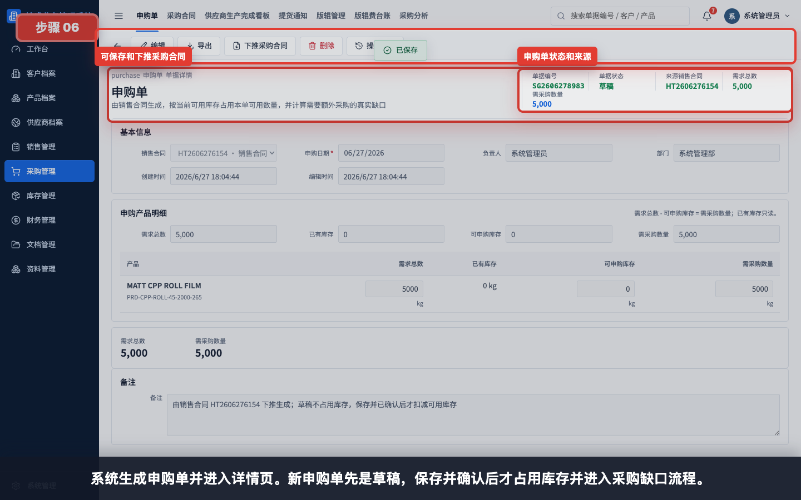

系统生成申购单并进入详情页。新申购单先是草稿，保存并确认后才正式占用库存并进入采购合同流程。

## 步骤 07：查看申购汇总

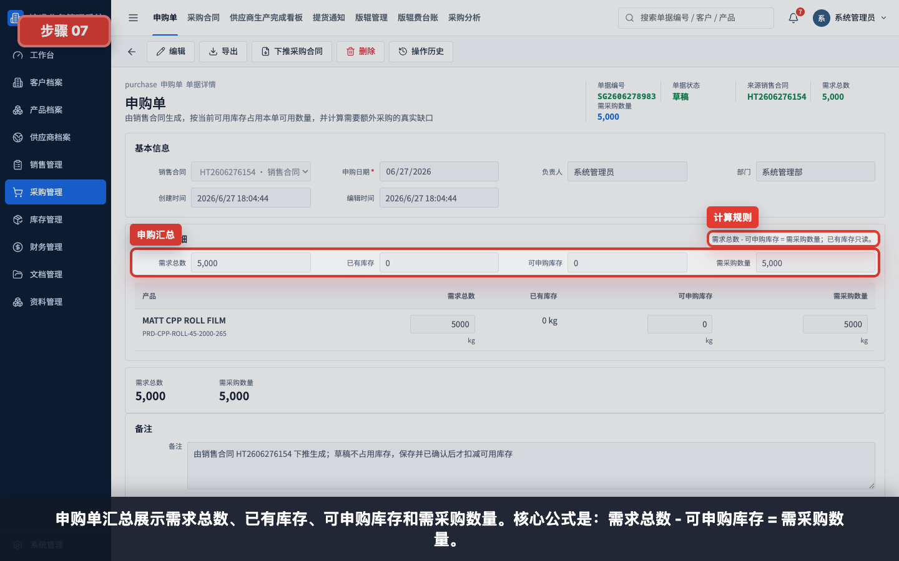

申购汇总展示需求总数、已有库存、可申购库存和需采购数量。培训时应重点解释公式：

```text
需求总数 - 可申购库存 = 需采购数量
```

示例图中需求总数为 5,000，可申购库存为 0，因此需采购数量为 5,000。

## 步骤 08：查看产品采购缺口

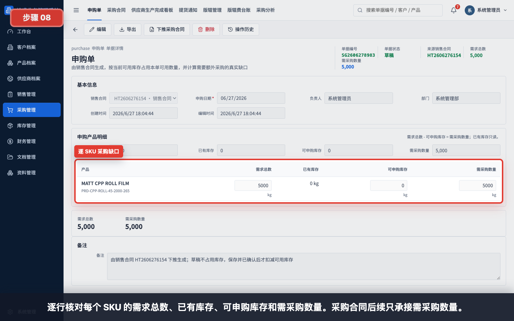

逐行核对每个 SKU 的需求总数、已有库存、可申购库存和需采购数量。后续采购合同只应承接“需采购数量”。

核对建议：

- SKU 和品名是否对应销售合同。
- 需求数量是否等于客户合同数量。
- 可申购库存是否符合当前库存判断。
- 需采购数量是否符合业务预期。

## 步骤 09：核对来源销售合同

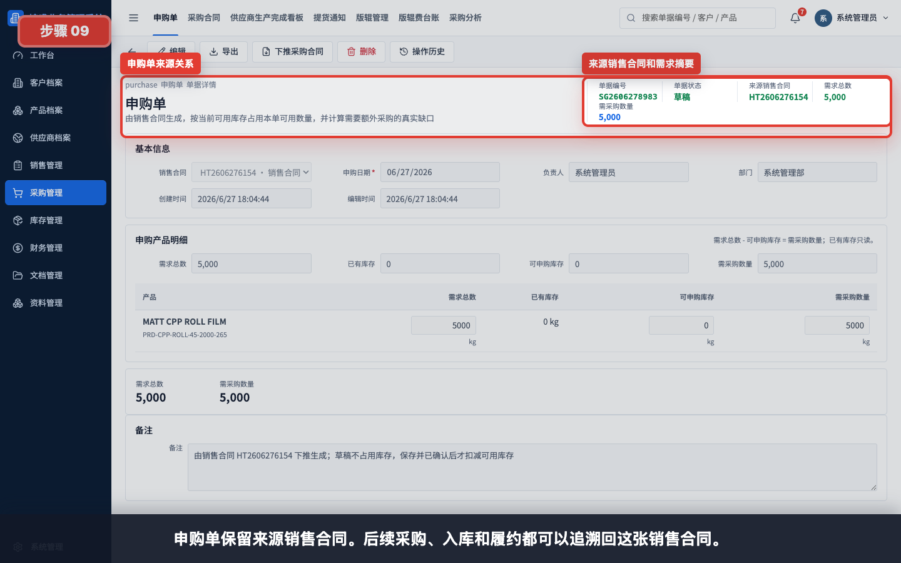

申购单会保留来源销售合同。后续采购、提货、入库、出库和财务核对都可以追溯回这张销售合同。

## 步骤 10：填写备注并保存申购单

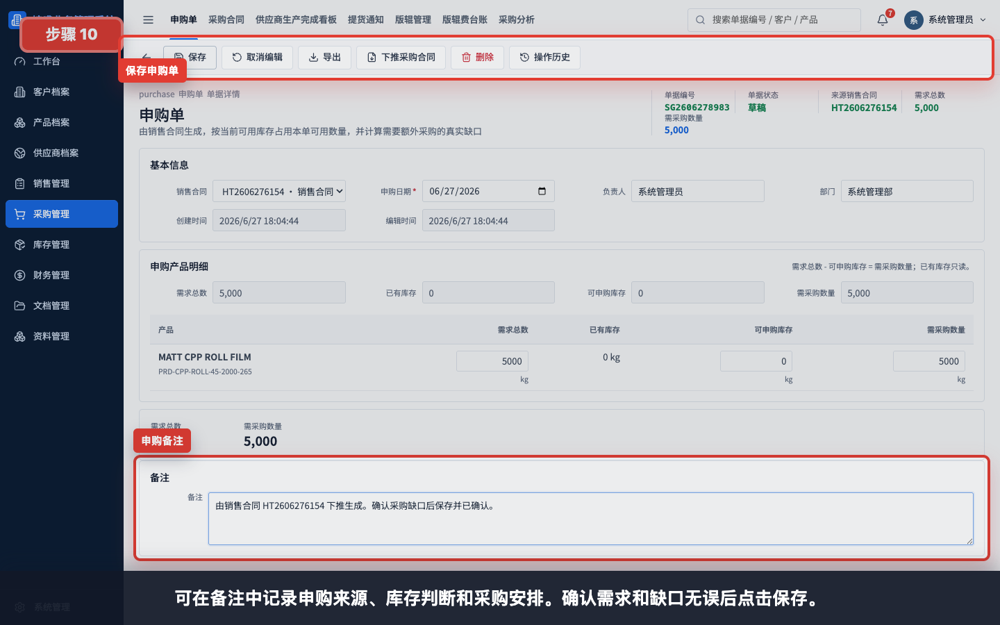

如有必要，在备注中写明申购来源、库存判断、采购安排或特殊交付要求。确认产品和采购缺口无误后点击保存。

备注示例：

```text
由销售合同 HT2606276154 下推生成。确认采购缺口后保存并已确认。
```

## 步骤 11：保存并确认申购单

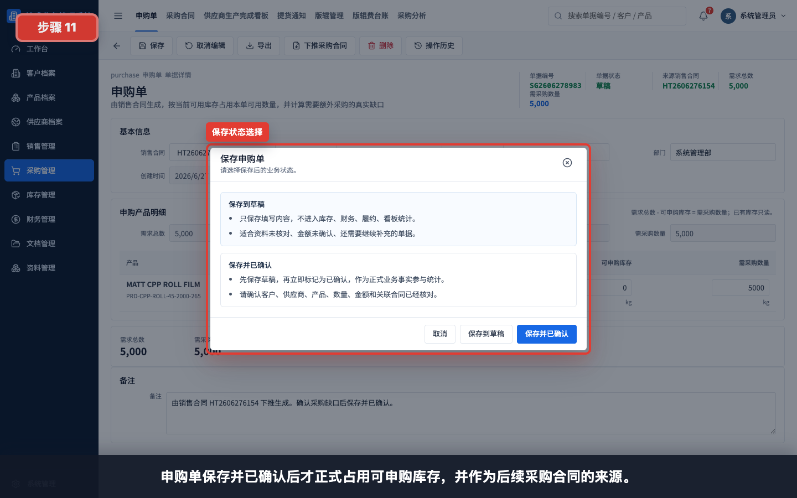

资料未齐时可以先保存到草稿；确认需求和缺口无误后选择“保存并已确认”。已确认申购单才正式占用可申购库存，并作为后续采购合同的来源。

状态说明：

| 状态 | 适用情况 | 后续影响 |
|---|---|---|
| 保存到草稿 | 仍需复核产品、数量、库存或备注 | 不应进入正式采购 |
| 保存并已确认 | 销售需求、库存占用和采购缺口已确认 | 可下推采购合同，并参与后续统计 |

## 步骤 12：回到申购单列表验证

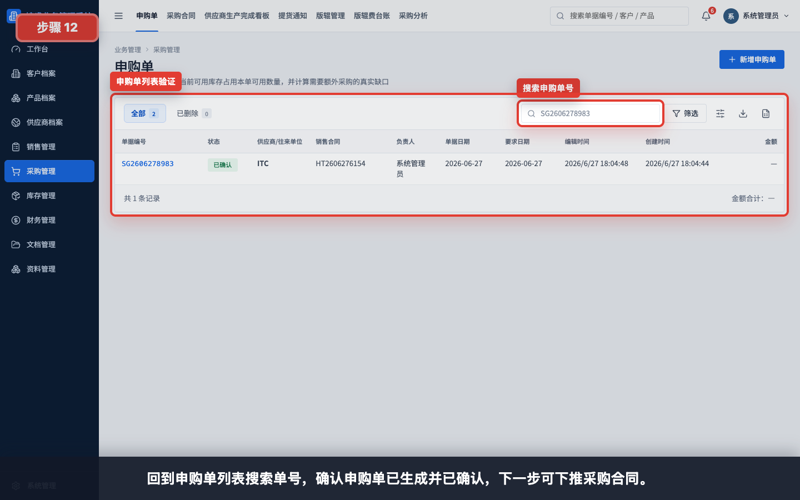

保存后回到“采购管理 > 申购单”，搜索申购单号，确认申购单已生成并已确认。

## 步骤 13：查看下推采购合同入口

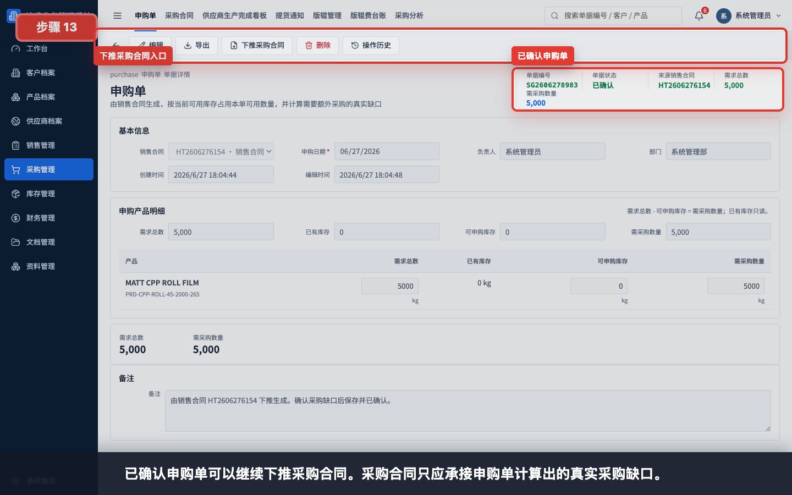

已确认申购单可以继续下推采购合同。采购合同应只承接申购单计算出的真实采购缺口。

## 常见错误

- 销售合同还在草稿状态就尝试下推申购单，导致无法进入正式申购流程。
- 没有核对产品行，导致错误 SKU 或错误数量进入采购准备。
- 把“已有库存”误认为一定可用，忽略库存可能已被其他业务占用。
- 手工修改可申购库存后没有复核公式，导致需采购数量不符合实际。
- 申购单只保存到草稿，忘记保存并已确认，后续无法稳定下推采购合同。
- 重复下推同一张销售合同。系统通常会打开已有下游单据，应避免人为重复采购。
- 跳过申购单直接手工创建采购合同，导致采购数量缺少库存缺口依据。

## 保存前检查清单

- 销售合同状态为已确认。
- 客户、产品、数量、单位和交付要求已经核对。
- 申购单来源销售合同正确。
- 每个产品的需求总数、可申购库存和需采购数量已核对。
- 备注已写清采购安排或特殊说明。
- 确认可以进入采购后，选择“保存并已确认”。

